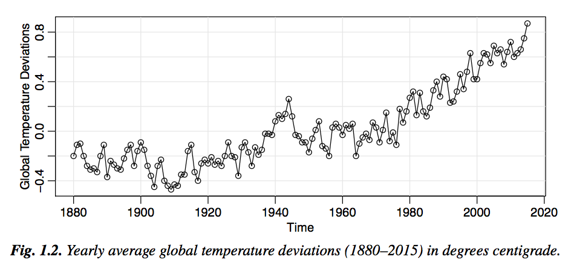
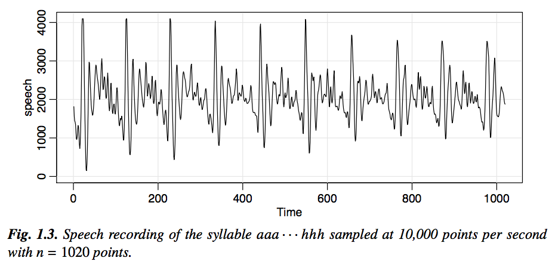
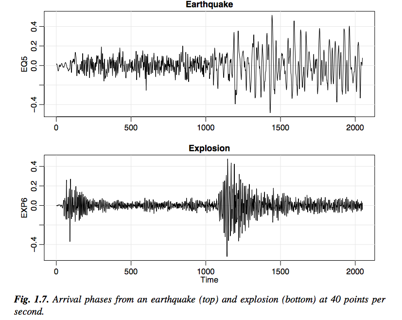
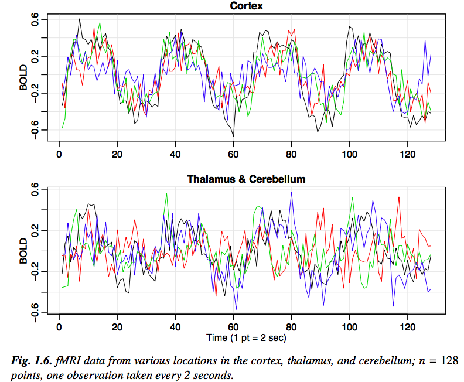
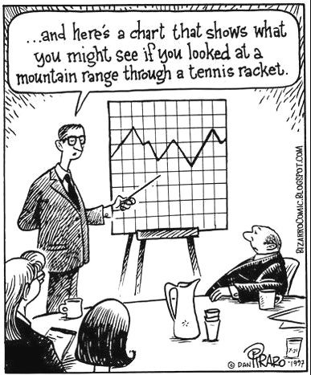
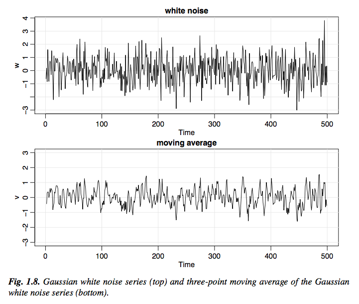

<!-- git add . && git commit -m "update" && git push  -->

[Goals]{.kicker}

- To look at some simple time series plots
- To introduce $\mathsf{WN}$, $\mathsf{MA}$ and $\mathsf{AR}$ models
- To define $\mathsf{ARMA}(p, q)$ models
- To understand the lag operator and polynomials in the lag operator

[Key Equation]{.kicker}

$$\Phi(L) Y_t = \Theta(L)\varepsilon_t, \text{ where } \varepsilon_t \sim \mathsf{WN}(0, \sigma_\varepsilon^2) \text{ and } \Phi(L) \text{ and } \Theta(L) \text{ are lag polynomials}$$

------------------------------------------------------------------------

## Examples of time series plots

- We learned that one primary objective of time series analysis is to develop statistical models that provide plausible descriptions for data that are temporally ordered. Let us look at an (arbitrarily-chosen) example now.



- Notice that it is conventional, when displaying such data graphically, to plot the values of the data points on the vertical or $y$ axis, with the time scale on the horizontal or $x$ axis. It is also common practice to connect the values at adjacent time periods to reconstruct visually some original hypothetical continuous time series that might have produced these values as a discrete sample.[^continuous]

- To formally characterise data that seemingly fluctuate in random fashion over time, statisticians assume that any real-life sample considered is obtained as a realisation of a collection of random variables (i.e. a stochastic process) indexed according to the order they are obtained in time.

- For example, we may consider as a time series the sequence of random variables, $Y_1, Y_2, Y_3, \ldots$, where $Y_1$ denotes the value taken by the series at the first time point, the variable $Y_2$ denotes the value for the second time point, and so on. The stochastic process is denoted $\{Y_t\}$. Note that in all our lectures, $t$ will be discrete and vary over the integers, $t = 0, \pm 1, \pm 2, \ldots$, or some subset of the integers, such as $t = 1, \ldots, T$. It will also be assumed that our observations are spaced equally.

- The next step is to **understand how to specify a (parametric) statistical model that suitably characterises the inter-temporal dependence structure** between the random variables within the (presumably stable) stochastic process. These are the models we will study shortly. (We will subsequently also explore the key ideas behind model selection and parameter estimation.)

- On the next page, we briefly contemplate the visual patterns that arise in a few more examples of time series data (chosen by me for reasons that will become clearer in future weeks). In case you are interested, the contextual details about these graphs are in **SS (Chapter 1.1)**.

[^continuous]: Although we plot data in this fashion, note that (i) we will NOT study continuous time series models in this course (nevertheless, do be aware that they comprise an entire field of study in financial modelling — e.g. for use in option pricing and/or high-frequency trading); and (ii) we will NOT get into issues surrounding selection of the sampling rate when discretising a continuous time series even though these issues can be extremely important.









------------------------------------------------------------------------

## Building blocks of the ARMA framework

::::: slidebox
[What is a white noise process?]{.slide-label}

::: slide-body
**Definition.** Consider a stochastic process $\{Y_t\}$ where $\mathsf{E}(Y_t) = \mu_Y$ and $$\text{Cov}(Y_t, Y_s) = \begin{cases} 0 < \sigma_Y^2 < \infty, & t = s, \\ 0, & \text{otherwise} \end{cases}$$ for $t, s \in \mathbb{Z}$. We say that $\{Y_t\}$ is a white noise process with mean $\mu_Y$ and variance $\sigma_Y^2$, or simply $Y_t \sim \mathsf{WN}\left(\mu_Y, \sigma_Y^2\right)$. (The mean $\mu_Y$ is most often assumed zero.) $\qquad\square$

- A white noise process (or informally, just "noise") is a collection of time-ordered yet **uncorrelated** random variables. An example would be the typical $Y_t \overset{\scriptscriptstyle\text{iid}}{\sim} \mathcal{N}\left(\mu_Y, \sigma_Y^2\right),\ t \in \mathbb{Z}$ process that you've worked with but note that neither is normality (or "Gaussianity") nor is the $iid$ assumption needed for a process to be classified as noise.
:::

::: slide-footer
A collection of time-ordered yet uncorrelated random variables.
:::
:::::

::::: slidebox
[How is noise even relevant? Are we not studying dependent processes?]{.slide-label}

::: slide-body
- The perceptive student may wonder why a white noise process gets prime billing in a course whose central concern is serial correlation. It seems odd, does it not? Indeed, if the stochastic behaviour of all time series could be explained in terms of the white noise model, classical statistical methods would suffice!

- I would like you to appreciate that one of the key features of the $\mathsf{ARMA}$ framework (which we are about to study) is that even **processes with highly-sophisticated dependence structures can be built just by linearly combining — or in time series parlance, "filtering" through — uncorrelated random variables**. The simple white noise process thus serves as the springboard for the rest of the theory, and this is truly remarkable!

- Let's see how it works. Ways of introducing dynamics are discussed below. But first, let us define a linear filter...
:::

::: slide-footer
Noise is the springboard: rich dependence is built by filtering uncorrelated random variables.
:::
:::::

Terms and phrases commonly-used in place of "dynamics" that you might encounter in your studies include "inter-temporal dependence", "persistence", "smoothness", and "inertia", to name a few.

::::: slidebox
[What is a linear filter?]{.slide-label}

::: slide-body
A linear (time-invariant) filter or "smoother" converts one time series, $\{\varepsilon_t\}$, into another, $\{Y_t\}$, by the linear operation $$Y_t = \sum_{h=-q}^{+s} a_h\,\varepsilon_{t+h},$$ where $\{a_h\}$, for $h = -q, \ldots, s$ is a set of weights for $q, s \in \mathbb{N}$. Notice that the filter is symmetric when $s = q$ and $a_h = a_{-h}$.

- Formally, a linear filter is a polynomial in the lag operator, but we will see the formal definition after we introduce the concept of a lag operator (in [The ARMA framework](#the-arma-framework) below).

- The simplest example of a two-sided symmetric filter is when $$a_h = \begin{cases} \frac{1}{2q+1}, & h \in \{-q, \ldots, 0, \ldots, q\} \\ 0, & \text{otherwise}, \end{cases}$$ so that the filtered value of $Y_t$ is given by $$Y_t = \frac{1}{2q+1}\sum_{h=-q}^{q}\varepsilon_{t+h}.$$

- Can you try to visualise the given operation and determine for yourself why a linear filter might synonymously be referred to as a smoother?
:::

::: slide-footer
A weighted sum of neighbouring noise terms; equal weights give a smoother.
:::
:::::

Consider, for example, $Y_t = (\varepsilon_{t-1} + \varepsilon_t + \varepsilon_{t+1})/3$. We have the following schematic to help describe this two-sided symmetric smoothing operation:

$$\begin{aligned} \underset{Y_2}{\underbrace{\tfrac{1}{3}\varepsilon_1 \quad \tfrac{1}{3}\varepsilon_2 \quad \tfrac{1}{3}\varepsilon_3}} \quad \varepsilon_4 \quad \varepsilon_5 \\ \varepsilon_1 \quad \underset{Y_3}{\underbrace{\tfrac{1}{3}\varepsilon_2 \quad \tfrac{1}{3}\varepsilon_3 \quad \tfrac{1}{3}\varepsilon_4}} \quad \varepsilon_5 \\ \varepsilon_1 \quad \varepsilon_2 \quad \underset{Y_4}{\underbrace{\tfrac{1}{3}\varepsilon_3 \quad \tfrac{1}{3}\varepsilon_4 \quad \tfrac{1}{3}\varepsilon_5}} \end{aligned}$$

Do you see how we created a completely new series, $\{Y_2, Y_3, Y_4\}$, from the original, $\{\varepsilon_1, \varepsilon_2, \varepsilon_3, \varepsilon_4, \varepsilon_5\}$?

Let us look at some graphs that help illustrate the distinction between white noise and the three-point moving average process above.



```r
> w = rnorm(500,0,1) # creates realisations of 500 iid N(0,1) RVs
> v = filter(w, sides=2, filter=rep(1/3,3)) # creates a moving average
> par(mfrow=c(2,1)) # specifies a 2 by 1 panel layout for graphs
> plot.ts(w, main="white noise")
> plot.ts(v, ylim=c(-3,3), main="moving average")
```

Consider, as a different example of a moving average, $Y_t = \varepsilon_t + 0.5\varepsilon_{t-1}$. We have the following schematic to help describe this one-sided smoothing operation:

$$\begin{aligned} \underset{Y_2}{\underbrace{0.5\,\varepsilon_1 \quad \varepsilon_2}} \quad \varepsilon_3 \quad \varepsilon_4 \quad \varepsilon_5 \\ \varepsilon_1 \quad \underset{Y_3}{\underbrace{0.5\,\varepsilon_2 \quad \varepsilon_3}} \quad \varepsilon_4 \quad \varepsilon_5 \\ \varepsilon_1 \quad \varepsilon_2 \quad \underset{Y_4}{\underbrace{0.5\,\varepsilon_3 \quad \varepsilon_4}} \quad \varepsilon_5 \\ \varepsilon_1 \quad \varepsilon_2 \quad \varepsilon_3 \quad \underset{Y_5}{\underbrace{0.5\,\varepsilon_4 \quad \varepsilon_5}} \end{aligned}$$

This example brings us now to the definition of $\mathsf{MA}(q)$ processes.

::::: slidebox
[What is an MA(q) process?]{.slide-label}

::: slide-body
**Definition.** A process $\{Y_t\}$ is called a moving average process of order $q$, with shorthand $Y_t \sim \mathsf{MA}(q)$, if there exists a white noise process $\varepsilon_t \sim \mathsf{WN}\left(0, \sigma_\varepsilon^2\right)$ and a set of finite constants $\theta_j$, for $j = 1, \ldots, q$, with $\theta_q \neq 0$, such that $$Y_t = \varepsilon_t + \theta_1\varepsilon_{t-1} + \cdots + \theta_q\varepsilon_{t-q},$$ for $t \in \mathbb{Z}$. $\qquad\square$

- An example (which we already saw) is the simple **$\mathsf{MA}(1)$ process** given by $$Y_t = \varepsilon_t + 0.5\varepsilon_{t-1}$$ where it is clear that $Y_t$ is serially correlated, since $$\text{Cov}(Y_t, Y_{t-1}) = \text{Cov}(\varepsilon_t + 0.5\varepsilon_{t-1}, \varepsilon_{t-1} + 0.5\varepsilon_{t-2}) = 0.5\sigma_\varepsilon^2,$$ even though $\varepsilon_t \sim \mathsf{WN}\left(0, \sigma_\varepsilon^2\right)$.

- It is worth re-emphasising that we have created in $\{Y_t\}$ a completely new process that exhibits very different dependence characteristics from serially uncorrelated process $\{\varepsilon_t\}$ just by linearly combining elements of the latter.
:::

::: slide-footer
A finite linear combination of current and past noise terms.
:::
:::::

Another way of introducing dynamics is by explicitly postulating a linear relationship between a random variable, $Y_t$, and its past values, $Y_{t-h}$ for $h > 0$. These relationships are referred to as autoregressions.

::::: slidebox
[What is an AR(p) process?]{.slide-label}

::: slide-body
**Definition.** A process $\{Y_t\}$ is called an autoregressive process of order $p$, with shorthand $Y_t \sim \mathsf{AR}(p)$, if there exists a white noise process $\varepsilon_t \sim \mathsf{WN}\left(0, \sigma_\varepsilon^2\right)$ and a set of finite constants $\phi_j$, for $j = 1, \ldots, p$, with $\phi_p \neq 0$, such that $$Y_t = \phi_1 Y_{t-1} + \cdots + \phi_p Y_{t-p} + \varepsilon_t,$$ for $t \in \mathbb{Z}$. $\qquad\square$

- An example is the **$\mathsf{AR}(1)$ process** given by $$Y_t = \phi Y_{t-1} + \varepsilon_t, \qquad 0 < \phi < 1,$$ where the introduction of dynamics (relative to the $\mathsf{WN}$ case) can be illustrated by checking the autocovariances, which we will do in detail soon.
:::

::: slide-footer
The present regressed on its own finite past, plus noise.
:::
:::::

::::: slidebox
[Are we really just linearly combining noise again...?]{.slide-label}

::: slide-body
Understand that yet again we are **filtering through noise** in order to generate a complicated dynamic structure. To see this, try the following exercise:

$$\begin{aligned} Y_t &= \phi Y_{t-1} + \varepsilon_t \\ &= \phi^2 Y_{t-2} + \phi\varepsilon_{t-1} + \varepsilon_t \quad \text{by lagging/substituting once,} \\ &= \phi^3 Y_{t-3} + \phi^2\varepsilon_{t-2} + \phi\varepsilon_{t-1} + \varepsilon_t \quad \text{by lagging/substituting twice,} \\ &= \ldots \\ &= \phi^{h+1} Y_{t-h-1} + \sum_{k=0}^{h}\phi^k\varepsilon_{t-k} \quad \text{by lagging/substituting } h > 2 \text{ times.} \end{aligned}$$

Letting $h \to \infty$, we observe (since $|\phi| < 1$) that $$Y_t = \sum_{k=0}^{\infty}\phi^k\varepsilon_{t-k},$$ which tells us that **the given $\mathsf{AR}(1)$ process can clearly be interpreted as a (convergent) linear combination of (an infinite number of) uncorrelated random variables**.

The expression above is called the $\mathsf{MA}(\infty)$ representation of $\{Y_t\}$.
:::

::: slide-footer
Yes — an $\mathsf{AR}(1)$ unfolds into an $\mathsf{MA}(\infty)$: a convergent infinite filter of noise.
:::
:::::

::::: slidebox
[What more intuition can we glean from the algebra?]{.slide-label}

::: slide-body
Pay very close attention to the $\mathsf{MA}(\infty)$ representation of our $\mathsf{AR}(1)$ model, $$Y_t = \sum_{k=0}^{\infty}\phi^k\varepsilon_{t-k} \quad \text{where } 0 < \phi < 1,$$ as you read the bullets below:

- The current value of our $\mathsf{AR}(1)$ series ("$Y_t$") is ("$=$") an accumulation of an infinite stream ("$\sum_{k=0}^{\infty}$") of current and past noise elements ("$\varepsilon_t, \varepsilon_{t-1}, \varepsilon_{t-2}, \ldots$") where the effects (coefficients "$1, \phi, \phi^2, \ldots$") of the distant past (high $k$) are lower (since $|\phi| < 1$) than the effects of the recent past (low $k$).

- In other words, in the $\mathsf{AR}(1)$ model, the present depends on the *infinite* past, which is **very different to the $\mathsf{MA}(1)$** model. Nevertheless, the effect of the past on the present is *heavily dampened* the further back in time we go. Indeed, the coefficients in the $\mathsf{MA}(\infty)$ representation of our $\mathsf{AR}(1)$ process decay at a geometrically declining rate.

- Try to appreciate the speed of dampening that is built into an $\mathsf{AR}(1)$ model. Recall that geometric decay is the discrete equivalent of exponential decay (which is conventionally considered to be quite the benchmark for fast decay).
:::

::: slide-footer
The $\mathsf{AR}(1)$ depends on the infinite past, but with geometrically decaying weights.
:::
:::::

------------------------------------------------------------------------

## The ARMA framework

::::: slidebox
[What is an ARMA(p, q) process?]{.slide-label}

::: slide-body
**Definition.** A process $\{Y_t\}$ is called an $\mathsf{ARMA}$ process of orders $p$ and $q$, with shorthand $Y_t \sim \mathsf{ARMA}(p, q)$, if there exists a white noise process $\varepsilon_t \sim \mathsf{WN}\left(0, \sigma_\varepsilon^2\right)$, a set of finite constants $\phi_j$, for $j = 1, \ldots, p$, with $\phi_p \neq 0$, and another set of finite constants $\theta_k$, for $k = 1, \ldots, q$, with $\theta_q \neq 0$, such that $$Y_t = \phi_1 Y_{t-1} + \cdots + \phi_p Y_{t-p} + \varepsilon_t + \theta_1\varepsilon_{t-1} + \cdots + \theta_q\varepsilon_{t-q},$$ for $t \in \mathbb{Z}$. $\qquad\square$

- Examples are as follows: when **$q = 0$, we have an $\mathsf{AR}(p)$ process**, and when **$p = 0$, we have an $\mathsf{MA}(q)$ process**. When **$p = q = 0$, we have noise**.

- Let us express our modelling framework with more succinct lag polynomial notation. First, we must study what is the lag operator.
:::

::: slide-footer
An autoregression plus a moving average; $\mathsf{AR}$, $\mathsf{MA}$ and noise are special cases.
:::
:::::

::::: slidebox
[What is the lag operator? Also, what is the first-difference operator?]{.slide-label}

::: slide-body
- Given any time series, $\{Y_t\}_{t \in \mathbb{Z}}$, we **define the lag operator $L$** by $$LY_t = Y_{t-1}$$ and extend the definition to powers $$L^2 Y_t = L(LY_t) = LY_{t-1} = Y_{t-2},$$ and so on. Thus, $$L^k Y_t = Y_{t-k}$$ for $k = 0, \pm 1, \pm 2, \ldots$.

- Note that when $k < 0$, we refer to it as a "**lead**" rather than a lag.

- We **define the first-difference operator, $\Delta$, by $\Delta := (1 - L)$** and it works as expected. For example, $$\begin{aligned} \Delta^2 Y_t &= (1 - L)^2 Y_t = (1 - 2L + L^2)Y_t = Y_t - 2Y_{t-1} + Y_{t-2} = \Delta Y_t - \Delta Y_{t-1} \\ &= \Delta(\Delta Y_t) \end{aligned}$$
:::

::: slide-footer
$L$ shifts the series back one period; $\Delta := (1 - L)$ takes first differences.
:::
:::::

::::: slidebox
[What are lag polynomials?]{.slide-label}

::: slide-body
- Define the **$\mathsf{AR}$ lag polynomial** of order $p$ to be $$\Phi(L) = 1 - \phi_1 L - \phi_2 L^2 - \ldots - \phi_p L^p$$ and the **$\mathsf{MA}$ lag polynomial** of order $q$ to be $$\Theta(L) = 1 + \theta_1 L + \theta_2 L^2 + \ldots + \theta_q L^q.$$

- The **order** $p$ is thus the highest power with which the lag operator appears in the $\mathsf{AR}$ lag polynomial with a non-zero coefficient. The order $q$ is defined analogously on the basis of the $\mathsf{MA}$ lag polynomial.
:::

::: slide-footer
Polynomials in $L$ that package the $\mathsf{AR}$ and $\mathsf{MA}$ coefficients.
:::
:::::

::::: slidebox
[How can we express the ARMA(p, q) model using L notation?]{.slide-label}

::: slide-body
- The $\mathsf{ARMA}(p, q)$ process $\{Y_t\}$ can be expressed simply as $$\Phi(L) Y_t = \Theta(L)\varepsilon_t$$ where $\varepsilon_t \sim \mathsf{WN}\left(0, \sigma_\varepsilon^2\right)$ and polynomials $\Phi(\cdot)$ and $\Theta(\cdot)$ are as defined previously. Now is that not a lot more concise?!

- As an example, consider again the $\mathsf{AR}(1)$ process $$Y_t = \phi Y_{t-1} + \varepsilon_t,$$ which can be written using the above notation with $\Phi(L) = 1 - \phi L$ and $\Theta(L) = 1$.
:::

::: slide-footer
$\Phi(L) Y_t = \Theta(L)\varepsilon_t$ — the whole framework in one line.
:::
:::::

::: callout-note
## Remark

We often will work with these polynomials in the lag operator as though they are standard mathematical functions — i.e. outside the realm of time series analysis. For instance, we may want to mechanically find the root of the $\mathsf{AR}$ polynomial in the previous example, that is to solve for $\Phi(z) = 1 - \phi z = 0$ where $z \in \mathbb{C}$. Notice, when we do this, that we switch the argument to considering some arbitrary $z \in \mathbb{C}$. The reason is that it would be silly, for instance, to say something like $$\text{“}\Phi(L) = 0 \iff L = 1/\phi\text{”}$$ because $L$ is a lag operator, not a complex number. $\qquad\square$
:::

------------------------------------------------------------------------

## Review questions

1.  What are the formal definitions of $\mathsf{AR}$, $\mathsf{MA}$ and $\mathsf{ARMA}$ models? Ensure to frame each of your answers in terms of the $L$ operator. Further, give the definition of the order of a polynomial.[^memorise]

2.  Consider the process given by $$(1 - 0.5L)Y_t = \varepsilon_t$$ where $\varepsilon_t$ is our usual noise. Mr Tick Whittington insists that $\{Y_t\}$ is $\mathsf{AR}(1)$, but his brother, Tock, insists that $\{Y_t\}$ is $\mathsf{MA}(\infty)$. Who is correct? Tick...? Tock...?

[^memorise]: Yes, I do expect my students to memorise all definitions. (It is important to do so for your learning in this field.)

------------------------------------------------------------------------

## Further reading

- There is overlap with Topic 1 in the reading. See **SS (Chapter 1.1–1.2)** also for Topic 2.

------------------------------------------------------------------------
