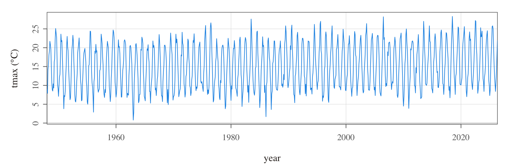
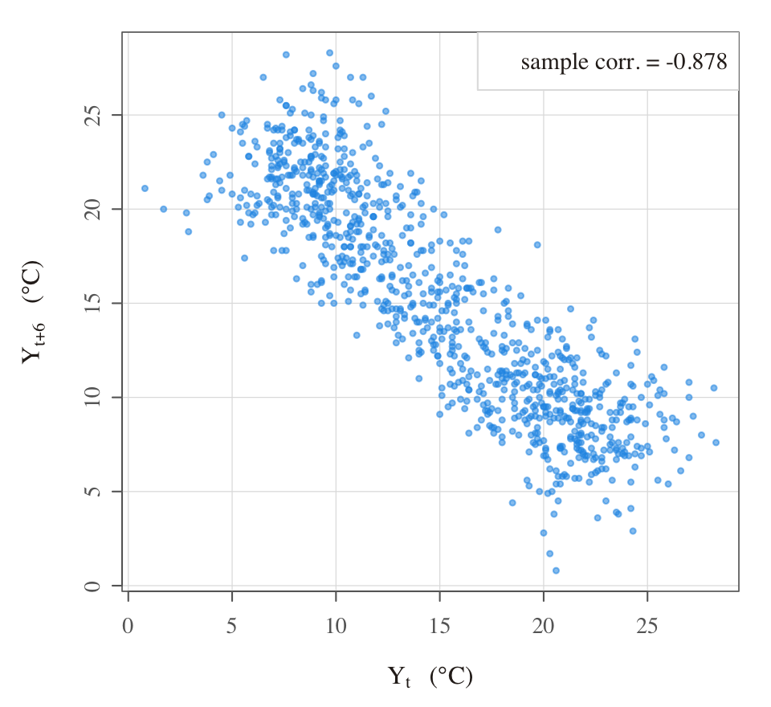
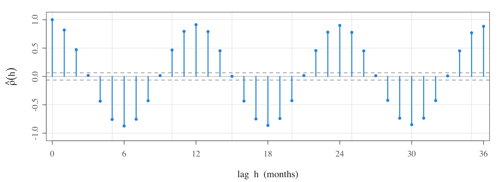
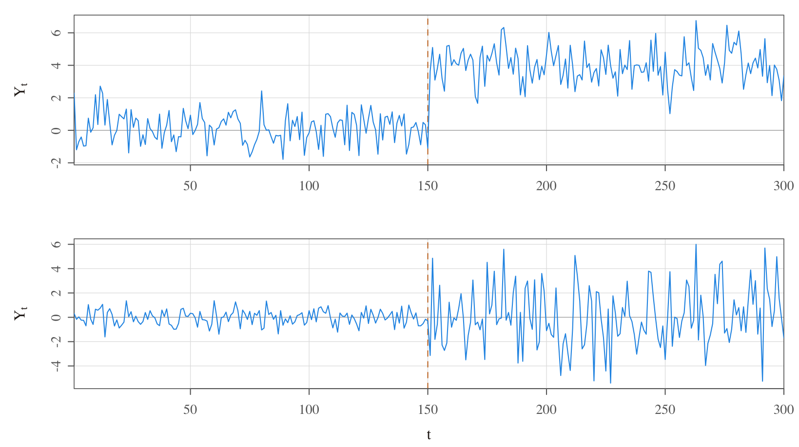

<!-- git add . && git commit -m "update" && git push  -->

[Goals]{.kicker}

- To introduce autocovariance (ACVF) and autocorrelation functions (ACF).

[Key Equation]{.kicker}

$$\gamma_Y(t,s)=\text{Cov}\left(Y_t, Y_s\right)=\mathsf{E}\!\left[\left(Y_t-\mathsf{E}(Y_t)\right)\left(Y_s-\mathsf{E}(Y_s)\right)\right] \quad \text{for } t,s \in \mathbb{Z}$$

------------------------------------------------------------------------

## Characterising a time series

::::: slidebox
[How should we characterise a time series? The entire joint CDF?]{.slide-label}

::: slide-body
- Recall we said that a time series is just a specific type of stochastic process, which is itself just a collection of random variables.

- As is usual in statistics, a complete description of a set of random variables, $\{Y_1, Y_2, \ldots, Y_T\}$, would be given by their joint CDF, $$\Pr(Y_{t_1} \leq c_1, Y_{t_2} \leq c_2, \ldots, Y_{t_T} \leq c_T),$$ for any $T \in \mathbb{N}$ and arbitrary periods $t_1, t_2, \ldots, t_T$, whereas more economical descriptions can be had in terms of the first and second order moments alone.
:::

::: slide-footer
The joint CDF describes a time series completely.
:::
:::::

::::: slidebox
[Or only the second-order structure?]{.slide-label}

::: slide-body
- Although the joint CDF describes a time series completely (i.e. since it contains joint, conditional, as well as marginal information), it is an unwieldy tool for analysis. (For instance, the joint CDF must be evaluated as a function of $T$ arguments, so any plotting of the corresponding joint PDF is virtually impossible.)

- Further, the joint CDF cannot usually be worked out with ease unless the random variables are jointly normal, say $\mathbf{Y} \sim \mathcal{N}(\mu, \Sigma)$, in which case the joint density has the form (which you do not need to memorise): $$f_{\mathbf{Y}}(\mathbf{y}) = (2\pi)^{-\frac{n}{2}}|\Sigma|^{-\frac{1}{2}}\exp\!\left(-\frac{1}{2}(\mathbf{y}-\mu)'\Sigma^{-1}(\mathbf{y}-\mu)\right),$$ for $\mathbf{Y} := (Y_1, \ldots, Y_T)' \in \mathbb{R}^T$. (It is also called the Gaussian distribution.)

- Since *linear* dependence is an essential feature of most (at least introductory-level) time series analysis, the most useful descriptive measures are **autocovariance and autocorrelation functions**. We look at these next.
:::

::: slide-footer
The second-order structure is the economical, workable description we will use.
:::
:::::

It is worth appreciating explicitly at this point that dependence can be linear or non-linear in nature. Consider, for example, $y^{lin}_t = t + \varepsilon_t$ where $\varepsilon_t \overset{\scriptscriptstyle\text{iid}}{\sim} \mathcal{N}(0,1)$ for $t = 1, \ldots, T$. Also consider another example given by $y^{quad}_t = t^2 + \varepsilon_t$ where definitions (of $t$ and $\varepsilon_t$) are as above. Below, we plot single sample paths from each of these two processes to illustrate how a **correlation coefficient only captures linear dependence characteristics**.


What is the key message of the graphs? First, notice that both $y^{lin}_t$ and $y^{quad}_t$ are highly dependent on $t$. However, the former exhibits linear dependence on $t$, whereas the latter exhibits quadratic dependence on $t$. The strength of dependence (while not directly comparable) can be thought of, loosely speaking, as similar in both cases; that is, since the error variance is identical. Nevertheless, the **sample correlation coefficient between $y^{lin}_t$ and $t$ is close to $1$, whereas between $y^{quad}_t$ and $t$ is close to $0$**. This simple example reveals that the sample correlation coefficient is a statistic that is utterly unable to capture non-linear dependence characteristics (unlike, for example, copulas). But this is ok since our focus on covariances/correlations will already take us a long way forward in our journey through the subject.

::: {.callout-note collapse="true"}
## R code

```r
rm(list = ls())                                  # clears global environment
set.seed(123456)                                 # allows replicability
t = seq(-1, 1, by = .05)                          # generates t
eps <- ts(rnorm(length(t), mean = 0, sd = .05))   # simulates white noise
ylin  <- t + eps                                  # generates ylin
yquad <- t^2 + eps                                # generates yquad
print(cor(ylin, t))                               # sample correlation between ylin_t and t
print(cor(yquad, t))                              # sample correlation between yquad_t and t
par(mfrow = c(1, 2), mai = c(1, 1, .5, .5))        # invokes a panel layout for graphs
plot(t, ylin,  main = "An example of linear association",
     xlab = "t \n (sample_corr. = 0.9961)",  ylab = "ylin",
     xlim = c(-1, 1), ylim = c(-1.5, 1.5), pch = 20)
plot(t, yquad, main = "An example of non-linear association",
     xlab = "t \n(sample_corr. = -0.0560)", ylab = "yquad",
     xlim = c(-1, 1), ylim = c(-.5, 1.5),  pch = 20)
```
:::

------------------------------------------------------------------------

## Autocovariance and autocorrelation functions

::::: slidebox
[What is an autocovariance function (ACVF)?]{.slide-label}

::: slide-body
**Definition.** Suppose that random variables in $\{Y_t\}$ are all characterised by finite variances. Then, the autocovariance function of process $\{Y_t\}$ is defined as $$\gamma_Y(s, t) = \text{Cov}\left(Y_s, Y_t\right) = \mathsf{E}\!\left[\left(Y_s - \mathsf{E}(Y_s)\right)\left(Y_t - \mathsf{E}(Y_t)\right)\right]$$ for all $s, t \in \mathbb{Z}$. $\qquad\square$

- We can drop the subscript $Y$ and just write $\gamma(s, t)$ when there is no ambiguity about which time series we are referring to.

- The mean function (which must exist if the autocovariance function exists) is defined as $$\mu_t := \mathsf{E}(Y_t) = \int_{-\infty}^{\infty} y\, f_{Y_t}(y)\, \mathsf{d}y,$$ where $f_{Y_t}(y)$ represents the marginal PDF of $Y_t$ evaluated at $y \in \mathbb{R}$.

- The smoother the series, the larger is the value of $\gamma(s, t)$ even for $s$ and $t$ far apart. On the other hand, choppy series tend to have values of $\gamma(s, t)$ that are nearly zero beyond low/moderate values of $|s-t|$ (at least in economics). Note that this is not a perfect measure of dependence. For instance, when $\gamma(s, t) = 0$, the variables $Y_s$ and $Y_t$ are not linearly related, but may still be dependent in a non-linear way.

- For exactly the same reasons as in classical statistics, we will also define a scale-free measure of the strength of linear association. (See next slide.)
:::

::: slide-footer
The autocovariance function summarises the linear dependence between $Y_s$ and $Y_t$.
:::
:::::

::::: slidebox
[What is an autocorrelation function (ACF)?]{.slide-label}

::: slide-body
**Definition.** Suppose that random variables in $\{Y_t\}$ are all characterised by finite variances. Then, the autocorrelation function of process $\{Y_t\}$ is defined as $$\rho(s, t) = \frac{\gamma(s, t)}{\sqrt{\gamma(s, s)\,\gamma(t, t)}}$$ for all $s, t \in \mathbb{Z}$. $\qquad\square$

- Note that autocorrelations only take values within the $[-1, 1]$ interval; and that the autocorrelation at lag $0$ is necessarily $1$.
:::

::: slide-footer
The scale-free counterpart of the autocovariance, bounded in $[-1, 1]$.
:::
:::::

------------------------------------------------------------------------

## An empirical example: Heathrow temperatures

I will leave it to you to generate and examine plots of population autocovariances and autocorrelations associated with simple time series models (e.g. in the problem sets). For now, instead, I will illustrate the use of these measures by means of a real-life empirical example.

Consider the following example of (the monthly average of the) maximum temperatures recorded at Heathrow between 1948 and 2026.



The series looks broadly stable over the long term (perhaps rising slightly towards the end...?) and it clearly exhibits oscillations throughout. Nevertheless, it is hard to say much more than that. Let us see how we can uncover more features about the dynamics of this series by considering relationships between the value of the series at a point, say $Y_t$, and previous values, say $Y_{t-h}$ for different values of $h = 1, 2, \ldots$.



The previous chart plots $Y_{t+6}$ against $Y_t$ for $t = 1, \ldots, T-6$, where $T$ is the length of the time series. As one would expect, there is a clear negative dependence between temperatures that are observed across separations of 6 months (a manifestation of seasonality). One could have created similar charts also for $h = 1, 2, 3, \ldots$, but that would be a lot of charts to stare at!

Alternatively, we could gather the sample correlation coefficients between $Y_t$ and $Y_{t-1}$, between $Y_t$ and $Y_{t-2}$, and between $Y_t$ and $Y_{t-3}$ and so on. I have not formally defined the so-called sample autocorrelation sequence for a stationary time series — I will certainly do so for you after the next section on stationarity. Nevertheless, suppose for the moment that we know how to compute sample autocorrelations denoted by $\hat{\rho}_Y(1)$, $\hat{\rho}_Y(2)$, $\hat{\rho}_Y(3)$, and so on, where the argument denotes the lag. Then, we could plot all of these on a single graph as below.



What do we learn? We see that the lag 12 sample autocorrelation is extremely high (and this is consistent with an annual temperature cycle). We also see that the lag 6 sample autocorrelation is extremely high in the negative direction (semi-annual seasonality). We further observe persistence over relatively short horizons (at lag 1 and lag 2) which conforms with the idea that temperatures evolve month-by-month in gradual fashion rather than all-of-a-sudden. All these insights (and possibly more) from just one chart!

------------------------------------------------------------------------

## Instability and the need for stationarity

::::: slidebox
[Extremely important remark]{.slide-label}

::: slide-body
- So far, we have (1) started to think formally about time series models; and (2) begun to characterise their dynamic behaviour in simple ways such as by looking at the autocovariance/autocorrelation structure.

- But what if the process alters its behaviour over time? What if, for example, the mean of a process changes? Or the lag 1 autocorrelation increases? Such changes are very difficult to handle (at least for introductory-level analyses).

- If we are to characterise time series sensibly (via their distributional properties), we need to assume some sort of regularity-over-time (for these distributional properties).

- In simple words, **our characterisation of how a series behaves over time cannot *itself* be changing over time**; otherwise, analysis of the past would be pointless for forecasting the future. We turn to this concern next.
:::

::: slide-footer
For analysis to be possible, the probabilistic structure must be regular over time.
:::
:::::

If you did not understand the previous slide, see examples below of so-called 'changepoints' which represent one possible form of instability: that is, abrupt and permanent changes in the probabilistic structure of a time series. While looking at these graphs, try to appreciate how futile it would be to use data *over time* to estimate the parameters of a model in which parameters are potentially changing *over time*.



Concluding remarks:

- Note that changes in the probability law that governs a time series can also be gradual (i.e. not sudden). So instabilities may not always be in terms of changepoints; rather, instability may arise, for instance, due to a slow drift in the mean or variance of a process. We will return to a discussion of these sorts of issues surrounding model instability much later in the course.

- For now, the goal is simply to understand that (i) there may exist instability in the data-generating process, (ii) any such instability would make time series analysis very complicated, and (iii) for this reason, we plan to formalise the notion of temporal regularity/stability — formally referred to as "stationarity" — in the next topic.

- Thereafter, at least for a while, we will limit our analysis to stationary time series; and only once we have analysed stationary series (that is, once we have built up our repertoire of knowledge and skills as analysts of stationary time series) will we turn our attention to non-stationary series.

------------------------------------------------------------------------

## Review questions

1.  Consider applying the three-point moving average that we saw in Topic 2 to a white noise series, $\varepsilon_t \sim \mathsf{WN}(0, \sigma^2_\varepsilon)$, as per: $$Y_t = (\varepsilon_{t+1} + \varepsilon_t + \varepsilon_{t-1})/3.$$ Show that the autocovariance function for $Y_t$ is given by: $$\gamma_Y(s, t) = \begin{cases} \frac{3}{9}\sigma^2_\varepsilon, & s = t \\ \frac{2}{9}\sigma^2_\varepsilon, & |s-t| = 1 \\ \frac{1}{9}\sigma^2_\varepsilon, & |s-t| = 2 \\ 0, & |s-t| > 2. \end{cases}$$

2.  Consider the expression for $\gamma_Y(s, t)$ given in Question 1 above. Describe, with explicit reference to $\gamma_Y(s, t)$, what you understand about the dynamics exhibited by $\{Y_t\}$.

------------------------------------------------------------------------

## Further reading

- See **SS (Chapter 1.3)**. In fact, if you would like to see specific solutions to the two review questions above, you can find them in Example 1.17 therein.

::: callout-note
## Data sources

The Heathrow figures are replotted from the UK Met Office historic station data for Heathrow (monthly mean daily maximum temperature, `tmax`), available under the Open Government Licence. The linear/non-linear association and changepoint figures are pure simulations (see the R above and `make_topic3_figs.R`). Per the course's figure policy, we regenerate every figure from data rather than reproducing rendered images.
:::

------------------------------------------------------------------------
