<!-- git add . && git commit -m "update" && git push  -->

[Goals]{.kicker}

- To select between candidate models by matching theoretical and sample dependence structures.
- To use the ACS and the partial autocorrelation sequence (PACS) to identify the orders of pure $\mathsf{MA}$ and pure $\mathsf{AR}$ processes.
- To introduce a formulaic approach to model selection via information criteria ($\mathsf{AIC}$ and $\mathsf{BIC}$).
- To estimate model parameters — the Yule–Walker estimator for $\mathsf{AR}$ models, and a glimpse of estimation in the mixed $\mathsf{ARMA}$ case.

[Key Equation]{.kicker}

$$\boldsymbol{\gamma}_p = \boldsymbol{\Gamma}_p \boldsymbol{\phi} \qquad\Longrightarrow\qquad \widehat{\boldsymbol{\phi}} = \big(\widehat{\boldsymbol{\Gamma}}_p\big)^{-1} \widehat{\boldsymbol{\gamma}}_p$$

------------------------------------------------------------------------

## Introduction

We are now ready to undertake elementary empirical analysis. The reason I describe it as such is *not* because our analysis will lack in rigour. On the contrary, if you have followed the course up to this point, you have strong foundations. Rather, I use the word 'elementary' because we are (for the moment) only equipped to analyse **stationary and ergodic time series**. This will be our focus throughout this topic.

To begin, let us recall two opening bullet points from earlier:

- Suppose we have a set of time series data, $\{Y_1, \ldots, Y_T\}$, which we wish to model for whatever reason (e.g. forecasting prices of financial assets, recovering dynamic causal effects of macroeconomic shocks, and so on).
- Since we always want a decent (albeit fundamentally flawed) approximation of reality, we try to pick a model whose defining characteristics match those of the real-life process under scrutiny. In particular, there is a great deal of interest in comparing their second-order moment structures.

Now, we will explore the practicalities of modelling in some detail. A very rough roadmap for the discussion ahead is the following loop:

1. **Build a toolkit** full of models (e.g. $\mathsf{ARMA}$).
2. **Pick a well-matched candidate** (e.g. via the ACS).
3. **Use data to estimate parameters** (e.g. via the method of moments).
4. **Use the fitted model for inference** (e.g. a hypothesis test).
5. **Perform diagnostic checks** (e.g. on residuals).

The loop runs from a question about reality (e.g. about markets) through to an insight about reality (e.g. a forecast).

## Model selection (manual)

Consider the first step in the schematic above. At this point, we have already built up a versatile toolkit of models — at least as far as stationary and ergodic time series are concerned. In particular, we have an arsenal full of causal (and, for any MSc students reading, invertible-in-the-past) $\mathsf{ARMA}$ models ready for deployment. The next question is how to pick one.

### $\mathsf{MA}(1)$ versus $\mathsf{AR}(1)$

To fix ideas, suppose the choice is between the simplest of models we have studied, the $\mathsf{MA}(1)$ and the $\mathsf{AR}(1)$ processes. How might we decide which of these two is appropriate? The answer, as expected, lies in the dependence structure.

::::: slidebox
[What is the theoretical ACS for $X_t \sim \mathsf{MA}(1)$?]{.slide-label}

::: slide-body
Suppose $X_t = \varepsilon_t + \theta \varepsilon_{t-1}$, where $\varepsilon_t \sim \mathsf{WN}(0,\sigma^2_{\varepsilon})$ and $0<|\theta|<1$.

Recall that the theoretical ACS in this case is given by $$ \rho_X(h) = \begin{cases} 1, &h=0\\ \dfrac{\theta}{1+\theta^2} , &| h|=1, \\ 0, &|h| \geq 2. \end{cases} $$
:::

::: slide-footer
The $\mathsf{MA}(1)$ ACS cuts off sharply beyond lag 1.
:::
:::::

::::: slidebox
[What is the theoretical ACS for $Y_t \sim \mathsf{AR}(1)$?]{.slide-label}

::: slide-body
Suppose $Y_t = \phi Y_{t-1} + \varepsilon_t$, where $\varepsilon_t \sim \mathsf{WN}(0,\sigma^2_{\varepsilon})$ and $0 < | \phi| <1$.

Recall that the theoretical ACS in this case is given by $$ \rho_Y(h) = \phi^{|h|}, \quad \text{ for } h = 0, \pm1, \pm2, \ldots $$
:::

::: slide-footer
The $\mathsf{AR}(1)$ ACS decays geometrically — it trails off.
:::
:::::

Below, we plot illustrative examples of the ACS in order to familiarise ourselves with typical $\mathsf{MA}$ and $\mathsf{AR}$ model signatures. In the charts, the horizontal axis is always the lag length (truncated to a maximum value of 10) and the vertical axis is always the value of the ACS, which is bounded between $-1$ and $1$. (We suppress the negative region when it is unnecessary.)

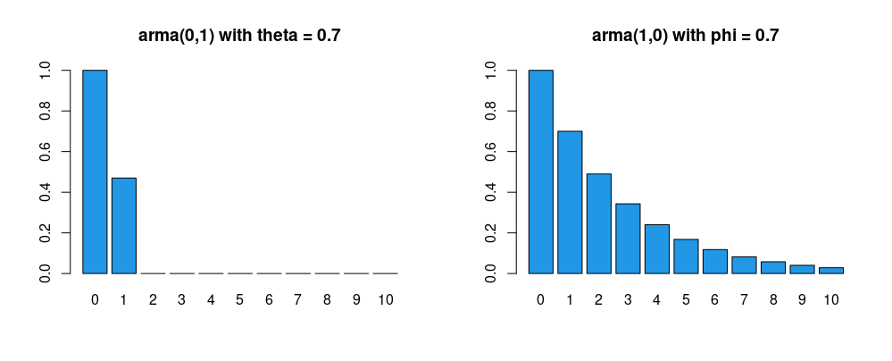

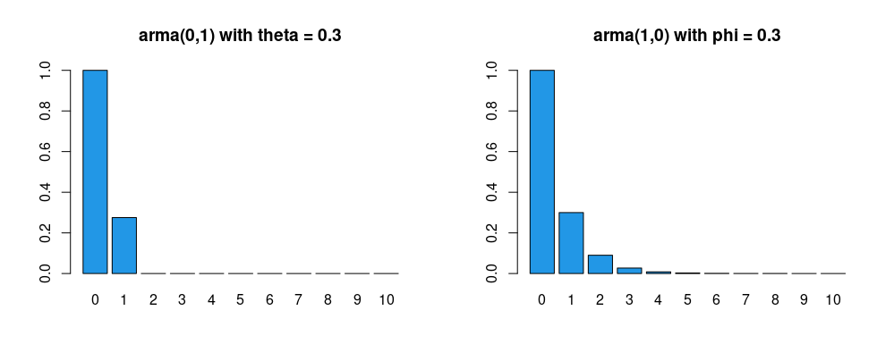

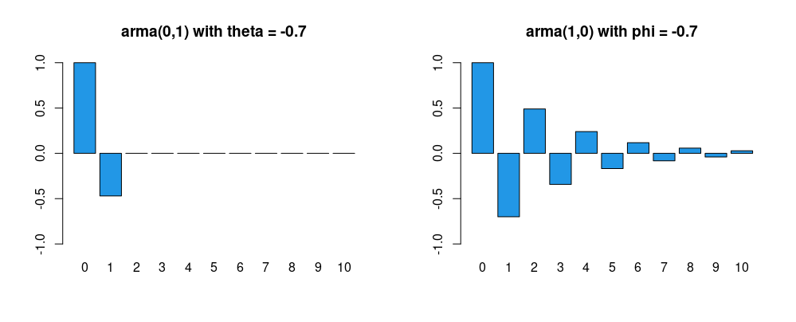

```r
rm(list = ls()); par(mfrow = c(1, 2))
x <- ARMAacf(0, 0.7, lag.max = 10); y <- ARMAacf(0.7, 0, lag.max = 10)
barplot(x, ylim = c(0, 1), main = 'arma(0,1) with theta = 0.7', col = 4)
barplot(y, ylim = c(0, 1), main = 'arma(1,0) with phi = 0.7', col = 4)
```

**Remark — think like statisticians, not economists.**

- An economist may wish to use an $\mathsf{MA}(1)$ model for various reasons. For example, economic indicators are affected by a variety of 'shocks' such as strikes, government decisions, shortages of key materials, and so on. Such shocks will not only have an immediate effect but may also affect economic indicators to a lesser extent in several subsequent periods, so it is at least plausible that an $\mathsf{MA}$ process may be justifiable.
- Similarly, an economist may wish to use an $\mathsf{AR}(1)$ model when there is reason to believe that the value of a variable is influenced by its own values in previous periods. For example, the habit-persistence theory of consumption suggests that consumption depends on the previous period's consumption, among other things.
- Note that we actually do **not** want to think about our task as per the above bullet points. It would simply cause confusion if we were to view this material through the 'structural' lens of an economist.
- Instead, we think like statisticians, matching model characteristics (specifically, the theoretical ACS) with comparable statistical measures based on real-world data (for example, the sample ACS) to make our modelling decisions.
- We are 'mercenaries' in the sense that we hold no desire to justify our decisions from an economic standpoint. Any economic justification, if insisted upon, may be introduced *ex post*, but not *ex ante*.

So how do we obtain the sample ACS? Let us discuss this next.

::::: slidebox
[How do we compute the sample ACS given time series data, $\{ Z_t \}_{t=1}^{T}$?]{.slide-label}

::: slide-body
For a stationary time series, $\{ Z_t\}$, with an absolutely summable ACVS, $\gamma_Z(h)$, we have already justified using the first sample moment $$ \bar{Z}_T := \frac{1}{T} \sum_{t=1}^{T} Z_t $$ as our estimator for the first population moment, $\mathsf{E}(Z_t)$ — i.e. we proved consistency of $\bar{Z}_T$ (recall the ergodic theorem).

We take as given (i.e. without justification) that $$ \hat{\gamma}_{Z}(h,T) := \frac{1}{T} \sum_{t=1}^{T-|h|} \left( Z_t - \bar{Z}_T \right) \left(Z_{t+|h|} - \bar{Z}_T  \right) $$ is a consistent estimator of $\gamma_Z(h)$. (We drop the extra $T$ argument hereafter.) Given the estimated ACVS, we then use $$ \hat{\rho}_Z(h) := \frac{\hat{\gamma}_{Z}(h)}{\hat{\gamma}_{Z}(0)}$$ as our (consistent) estimator of the ACS of $Z$.

- Given $T$ observations we can, in principle, compute the ACVS/ACS up to lag $T-1$. In practice we must stop well before $T-1$, because estimates for large $h$ are computed using too few data points (e.g. just a single pair if $h = T-1$).
- A useful rule of thumb is to compute the ACVS/ACS only up to lag $h \leq T/4$ when $T > 50$. (For lower $T$, report around 10 lags and caveat that precision may be low.)
:::

::: slide-footer
$\hat{\gamma}_Z(h)$ and $\hat{\rho}_Z(h)$ are consistent — but only trust them up to $h \le T/4$.
:::
:::::

The slide above gives us a mechanism for consistent **estimation** of the population ACS. The next question is how we do **inference** — i.e. how we carry out hypothesis tests.

::::: slidebox
[How do we conduct inference about the population ACS?]{.slide-label}

::: slide-body
Again without justification, we leverage central limit theory for the result that $$ \sqrt{T} \left( \hat{\rho}_Z(h) - \rho_Z(h)  \right) \overset{d}{\to} \mathcal{N}(0,\text{Bartlett}) \quad \text{ as } T\to \infty,$$ where $\text{Bartlett}$ is a complicated expression that simplifies to $1$ when $Z_t$ is noise.

- For this course, we just need to be aware that the result above is what $\mathsf{R}$ uses to plot the 95% acceptance region under a null of noise (the dashed blue lines around $0$ on our charts).
:::

::: slide-footer
Under a white-noise null, $\hat{\rho}_Z(h)$ is approximately $\mathcal{N}(0, 1/T)$ — hence the $\pm 2/\sqrt{T}$ bands.
:::
:::::

Consider the two simulated examples below. What do *you* think are the appropriate models?

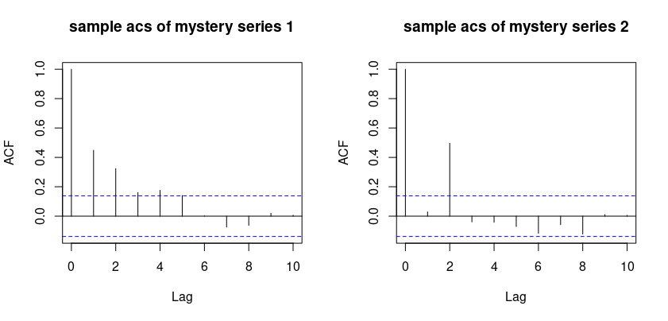

::::: slidebox
[What might a hypothetical student say about these plots?]{.slide-label}

::: slide-body
On the sample ACS of **mystery series 1**:

- "When I look at the first plot, I notice a pattern compatible with the geometric decay characteristic of an $\mathsf{AR}(1)$ process."
- "Since the choice here is between an $\mathsf{MA}(1)$ and an $\mathsf{AR}(1)$, I would prefer an $\mathsf{AR}(1)$ model."
- "The spike at lag 1 is around $0.4$ to $0.5$. This suggests an appropriate model might be $Y_t = 0.45 Y_{t-1} + \varepsilon_t$."

On the sample ACS of **mystery series 2**:

- "I notice immediate cutoffs (rather than geometric decay), more in line with a moving average than an autoregression. But this does not look like an $\mathsf{MA}(1)$ — it looks like data from an $\mathsf{MA}(2)$."
- "The most likely candidate appears to be $Y_t = \varepsilon_t + \theta_1 \varepsilon_{t-1} + \theta_2 \varepsilon_{t-2}$, with $\theta_1 = 0$ and $\theta_2 \neq 0$."
- "The spike at lag 2 is close to $0.5$, so I'm guessing $\theta_2$ is quite close to $1$ — perhaps $0.95$?"
:::

::: slide-footer
Read the *shape* (cut-off vs trail-off) and then the *spike heights* to guess parameters.
:::
:::::

```r
rm(list = ls()); set.seed(232); par(mfrow = c(1, 2))
x <- arima.sim(model = list(order = c(1, 0, 0), ar = 0.5), n = 200)
y <- arima.sim(model = list(order = c(0, 0, 2), ma = c(0, 0.9)), n = 200)
acf_x <- acf(x, 10, type = "correlation", main = 'sample acs of mystery series 1')
acf_y <- acf(y, 10, type = "correlation", main = 'sample acs of mystery series 2')
plot(acf_x); plot(acf_y)
```

### Identifying the order of pure $\mathsf{MA}$ and pure $\mathsf{AR}$ processes

The 'trick' above leads us directly to our next concern: how do we identify $q$ for an $\mathsf{MA}(q)$ process, and $p$ for an $\mathsf{AR}(p)$ process?

::::: slidebox
[How do we determine the order, $q$, for an $\mathsf{MA}(q)$ model?]{.slide-label}

::: slide-body
- For the $\mathsf{MA}(q)$ case, the exercise is (relatively) straightforward given the tools we already have: we **examine the ACS**.
- We look for the highest lag length beyond which autocorrelations vanish.
- We refer to this phenomenon by saying: **for a pure $\mathsf{MA}(q)$ process, the ACS cuts off beyond lag $q$.**
:::

::: slide-footer
The ACS gives *direct* information about $q$ for a pure moving average.
:::
:::::

The motivation is clear from the algebraic form of the ACS for an $\mathsf{MA}(q)$ process, which drops to zero beyond lag $q$. What about autoregressive series? What can we infer from the ACS about $p$? The answer is: "Not much."

::::: slidebox
[Why is the ACS not (directly) informative about $p$ in the $\mathsf{AR}(p)$ case?]{.slide-label}

::: slide-body
- Inspection of the ACS is not directly informative about $p$ since: **for a pure $\mathsf{AR}(p)$ process, the ACS trails off gradually.**
- The cut-off versus trail-off distinction helps us distinguish $\mathsf{MA}$ from $\mathsf{AR}$ models in the first place; and the exact location of the cut-off in the ACS helps identify $q$.
- But there is no specific location associated with a trail-off — the whole point is that autocorrelations decay gradually. So we need a different tool to identify $p$.
- We will therefore examine a new concept — partial autocorrelations.
- As a preview: **the partial autocorrelation sequence (PACS) speaks for $\mathsf{AR}$ models just as the ACS speaks for $\mathsf{MA}$ models.**
:::

::: slide-footer
Use the ACS to read $q$; use the PACS to read $p$.
:::
:::::

::::: slidebox
[What is partial autocorrelation? (Motivating example)]{.slide-label}

::: slide-body
Consider an $\mathsf{AR}(1)$ process, $Y_t = \phi Y_{t-1} + \varepsilon_t$, where $\varepsilon_t$ is noise.

- $Y_t$ and $Y_{t-2}$ are correlated even though $Y_{t-2}$ does not directly appear in the model. To see this, lag the model one period and substitute for $Y_{t-1}$: $Y_{t} = \phi^2 Y_{t-2} + \phi \varepsilon_{t-1} + \varepsilon_t.$
- The correlation between $Y_{t}$ and $Y_{t-2}$ (i.e. $\rho_Y(2)$) equals the correlation between $Y_{t}$ and $Y_{t-1}$ (i.e. $\rho_Y(1)$) times the correlation between $Y_{t-1}$ and $Y_{t-2}$ (i.e. $\rho_Y(1)$ again), so $\rho_Y(2) = \rho^2_Y(1)$.
- The effect of $Y_{t-2}$ on $Y_{t}$ is **indirect** — via the single-lag effect of $Y_{t-2}$ on $Y_{t-1}$ combined with the single-lag effect of $Y_{t-1}$ on $Y_{t}$.
- What we want is the **partial effect of $Y_{t-2}$ on $Y_{t}$, over and above any effect already explained through $Y_{t-1}$.**
- Intuitively, in the $\mathsf{AR}(2)$ case this partial effect should be non-zero, but in the $\mathsf{AR}(1)$ case it should be zero.
:::

::: slide-footer
Partial autocorrelation strips out the indirect dependence carried by intervening lags.
:::
:::::

::::: slidebox
[What is partial autocorrelation? (Definition)]{.slide-label}

::: slide-body
**Definition.** We define the partial autocorrelation sequence (PACS), $\zeta_Y(h)$, for a stationary process $\{Y_t\}$ by $$\begin{aligned} \zeta_Y(1) &= \rho_Y(1), \text{ and}\\ \zeta_Y(h) &= \text{Corr}\big(Y_t - \mathsf{E}(Y_t\mid Y_{t+1},\ldots,Y_{t+h-1}),\ Y_{t+h}- \mathsf{E}(Y_{t+h}\mid Y_{t+1},\ldots,Y_{t+h-1})\big) \end{aligned}$$ for $h = 2, 3, \ldots$. $\qquad\square$

- The partial autocorrelation is thus the correlation between $Y_{t}$ and $Y_{t+h}$ that remains after we purge the linear dependence of each term on the set of all intervening terms, $Y_{t+1}, \ldots, Y_{t+h-1}$.
:::

::: slide-footer
$\zeta_Y(h)$ = correlation of $Y_t$ and $Y_{t+h}$ after partialling out everything in between.
:::
:::::

:::: {.callout-note collapse="true"}
## Further intuition — the regression view, and a key theorem

Further intuition comes from viewing the partial autocorrelation through the lens of multiple regression. A coefficient $\beta_j$ in the regression $$ y_i = \beta_1 x_{i1} + \cdots + \beta_k x_{ik} + u_i $$ can be interpreted, under suitable assumptions, as the partial effect of $x_{ij}$ on $y_i$ controlling for the other included regressors. The formal justification for this 'partial effects' interpretation is the Frisch–Waugh–Lovell theorem.

It follows that in the autoregression $$ Y_{t} = \phi_1 Y_{t-1} + \phi_2 Y_{t-2} + \varepsilon_t, $$ we can interpret $\phi_2$ as the partial effect of $Y_{t-2}$ on $Y_{t}$ controlling for $Y_{t-1}$ — and indeed $\phi_2$ is the lag-2 partial autocorrelation, $\zeta_Y(2)$.

**Theorem (partial autocorrelation coefficients via regression).** For a causal $\mathsf{AR}(p)$ process $$ Y_t = \phi_1 Y_{t-1} + \cdots + \phi_p Y_{t-p} + \varepsilon_t, $$ where $\varepsilon_t \sim \mathsf{WN}(0,\sigma^2_{\varepsilon})$, it holds, for $h, p = 1, 2, \ldots$, that:

(i) $\zeta_Y(h) = \phi_p$ for $h = p$; and
(ii) $\zeta_Y(h) = 0$ for $h > p$; but
(iii) $\zeta_Y(h) \neq \phi_h$ for $h < p$ in general. $\qquad\square$

In this course, we leave the estimation of the PACS to statistical software.
::::

The plots below give illustrative ACS and PACS examples (sample code beneath).

```r
acs  <- ARMAacf(c(0.7), 0, lag.max = 10, pacf = FALSE); acs <- acs[2:11]
pacs <- ARMAacf(c(0.7), 0, lag.max = 10, pacf = TRUE);  names(pacs) <- 1:10
barplot(acs,  ylim = c(0, 1), main = 'acs for ar(1)\n phi=0.7',  col = 4)
barplot(pacs, ylim = c(0, 1), main = 'pacs for ar(1)\n phi=0.7', col = 4)
```

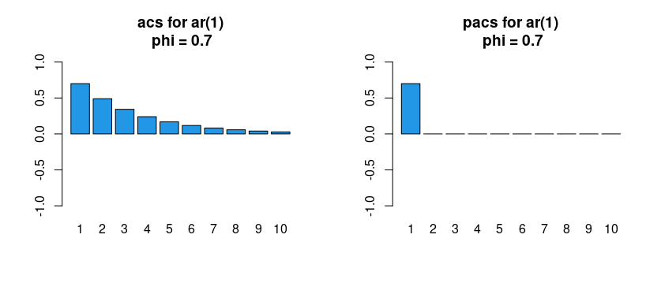

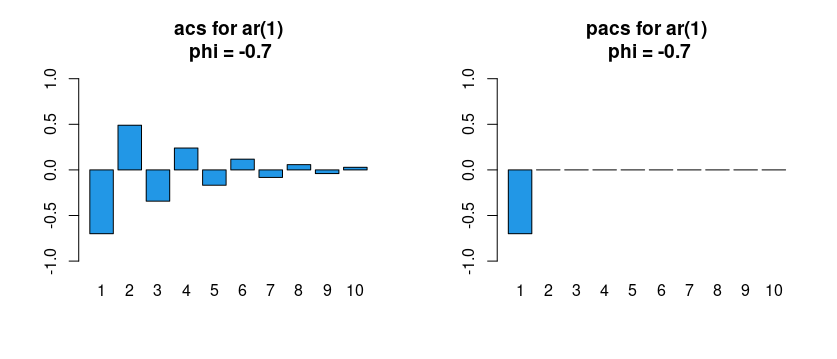

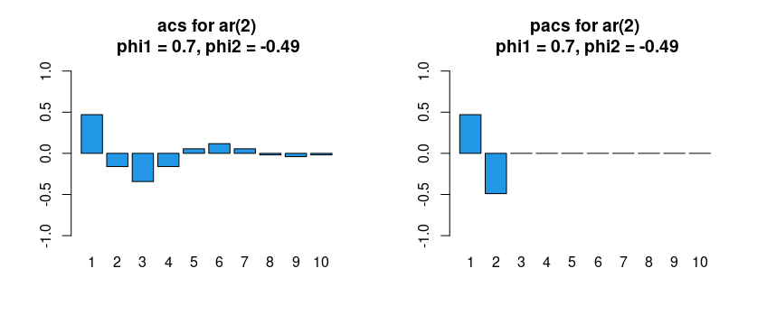

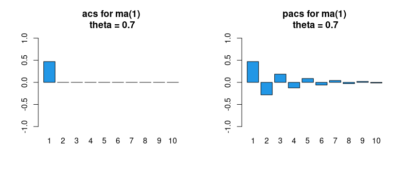

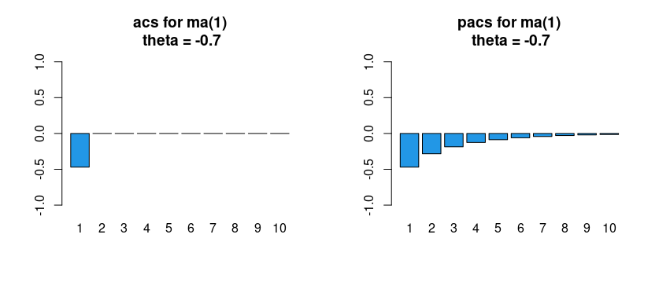

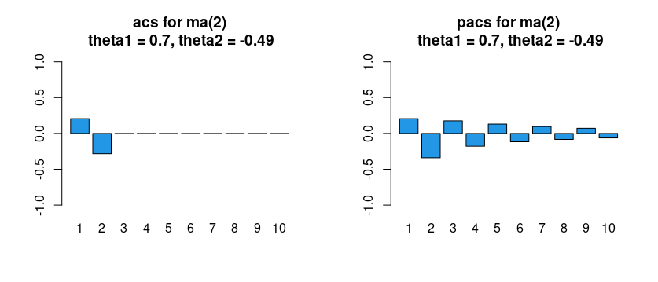

:::: {.callout-note collapse="true"}
## Watch: ACS vs PACS explorer

::: {.content-visible when-format="html"}
```{shinylive-r}
#| standalone: true
#| viewerHeight: 540

library(shiny)

ui <- fluidPage(
  tags$style(HTML("body{font-family:system-ui,sans-serif;}")),
  titlePanel("Theoretical ACS and PACS"),
  sidebarLayout(
    sidebarPanel(
      selectInput("model", "Model",
        c("AR(1)", "AR(2)", "MA(1)", "MA(2)", "ARMA(1,1)"), "AR(1)"),
      sliderInput("phi1", "AR coefficient phi_1", -0.95, 0.95, 0.7, 0.05),
      sliderInput("phi2", "AR coefficient phi_2", -0.95, 0.95, 0.0, 0.05),
      sliderInput("th1",  "MA coefficient theta_1", -0.95, 0.95, 0.5, 0.05),
      sliderInput("th2",  "MA coefficient theta_2", -0.95, 0.95, 0.0, 0.05)
    ),
    mainPanel(plotOutput("plot", height = "420px"))
  )
)

server <- function(input, output) {
  output$plot <- renderPlot({
    ar <- numeric(0); ma <- numeric(0)
    if (input$model == "AR(1)")      ar <- input$phi1
    if (input$model == "AR(2)")      ar <- c(input$phi1, input$phi2)
    if (input$model == "MA(1)")      ma <- input$th1
    if (input$model == "MA(2)")      ma <- c(input$th1, input$th2)
    if (input$model == "ARMA(1,1)") { ar <- input$phi1; ma <- input$th1 }
    acs  <- tryCatch(ARMAacf(ar, ma, lag.max = 10, pacf = FALSE)[2:11],
                     error = function(e) rep(NA, 10))
    pacs <- tryCatch(ARMAacf(ar, ma, lag.max = 10, pacf = TRUE),
                     error = function(e) rep(NA, 10))
    names(acs) <- names(pacs) <- 1:10
    par(mfrow = c(1, 2))
    barplot(acs,  ylim = c(-1, 1), main = paste("ACS:",  input$model), col = 4)
    abline(h = 0)
    barplot(pacs, ylim = c(-1, 1), main = paste("PACS:", input$model), col = 4)
    abline(h = 0)
  })
}

shinyApp(ui, server)
```
:::
::::

**Summary and next steps.** One extra insight emerges from the plots above: for $\mathsf{MA}$ models the PACS has no cut-off point but trails off to zero, just like the ACS in an $\mathsf{AR}$ model. Let us gather our findings.

::::: slidebox
[How can we summarise the previous plots?]{.slide-label}

::: slide-body
An **$\mathsf{AR}(p)$ process** is characterised by:

(i) an **ACS that trails off** gradually as lag length increases; and
(ii) a **PACS that cuts off** abruptly for lag lengths larger than $p$.

An **$\mathsf{MA}(q)$ process** is characterised by:

(i) an **ACS that cuts off** abruptly for lag lengths larger than $q$; and
(ii) a **PACS that trails off** gradually as lag length increases.
:::

::: slide-footer
$\mathsf{AR}$: ACS trails, PACS cuts. $\mathsf{MA}$: ACS cuts, PACS trails.
:::
:::::

:::: {.callout-note collapse="true"}
## For advanced / MSc students — the duality behind the signatures

A finite-order ($p<\infty$) causal $\mathsf{AR}(p)$ process corresponds to an infinite-order $\mathsf{MA}$ process, and a finite-order ($q<\infty$) invertible-in-the-past $\mathsf{MA}(q)$ process corresponds to an infinite-order $\mathsf{AR}$ process. This dual relationship is mirrored in the ACS and PACS: the $\mathsf{AR}(p)$ process has autocorrelations trailing off and partial autocorrelations cutting off, whereas the $\mathsf{MA}(q)$ process has autocorrelations cutting off and partial autocorrelations trailing off.
::::

### $\mathsf{ARMA}(1,1)$ and beyond

The difficulty in the mixed $\mathsf{ARMA}$ case is that such a model contains both an $\mathsf{MA}$ and an $\mathsf{AR}$ component. The implication is that **both** the ACS and the PACS exhibit a trail-off pattern. Let us confirm this with a couple of quick plots.

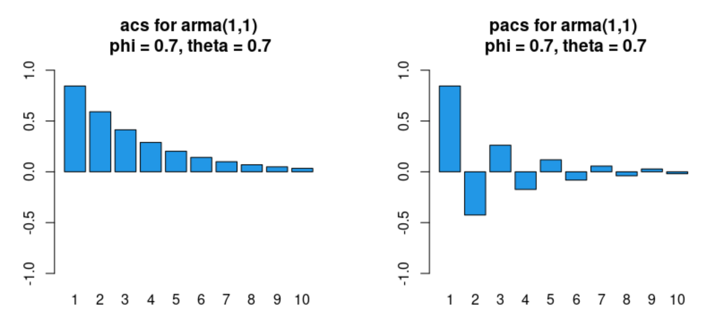

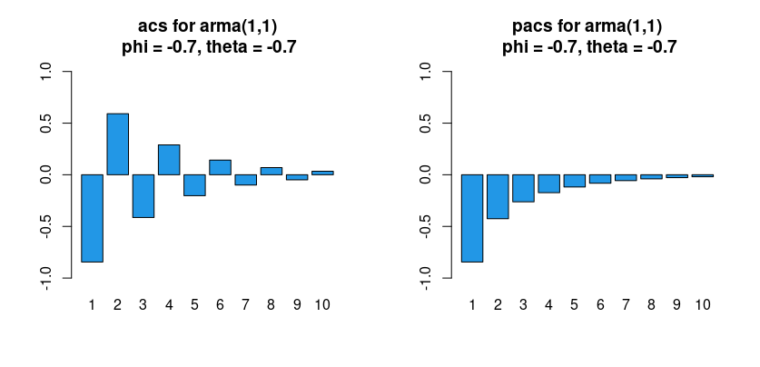

The takeaway is that **when there is no obvious cut-off pattern in either the ACS or the PACS, it is likely that we need a mixed $\mathsf{ARMA}$ process.**

How might we determine the orders of $\mathsf{ARMA}(p,q)$ processes for $p$ and $q$ potentially greater than $1$? Techniques exist, in principle, to identify $p$ and $q$ from the theoretical ACS and PACS. In practice, however, manual identification from the *sample* ACS and PACS — which deviate from their theoretical counterparts due to sampling error — becomes very difficult. We thus change gears and discuss a more formulaic method.

## Model selection (formulaic)

The over-arching principle in econometric modelling is to find a model that fits the data "well" using as parsimonious a specification as possible. We therefore need a criterion. We consider two well-known ones:

- *Akaike Information Criterion* ($\mathsf{AIC}$); and
- *Bayesian Information Criterion* ($\mathsf{BIC}$).

::::: slidebox
[What is the basic idea behind information criteria?]{.slide-label}

::: slide-body
Consider an $\mathsf{AR}(1)$ model to fix ideas. Say we estimate (e.g. via the method of moments) the model $Y_t = \phi Y_{t-1} + \varepsilon_t$ using a dataset $\{ Y_t\}_{t=1}^{T}$ to obtain $$\widehat{\phi} = \frac{\sum_{t=2}^{T} Y_{t-1} Y_t}{\sum_{t=1}^{T}Y^2_{t}} \quad\text{ and }\quad \widehat{\varepsilon}_t = Y_t - \widehat{\phi} Y_{t-1}.$$ One sensible way to assess quality of fit is the (estimated) in-sample mean square prediction error, $$ \mathsf{MSPE} = \frac{1}{T}\sum_{t=2}^{T} \left(Y_t - \widehat{\phi} Y_{t-1} \right)^2. $$

- The lower the $\mathsf{MSPE}$, the better the model fit is deemed.
- The problem is that estimating an $\mathsf{AR}(2)$ or $\mathsf{AR}(3)$ model would yield an $\mathsf{MSPE}$ no higher — and typically lower — than the $\mathsf{AR}(1)$ specification, because adding explanatory variables cannot increase unexplained variation.
- We thus augment the $\mathsf{MSPE}$ criterion with a **penalty for over-parameterisation**.
:::

::: slide-footer
Goodness of fit alone always rewards bigger models — so we must penalise complexity.
:::
:::::

::::: slidebox
[What are $\mathsf{AIC}$ and $\mathsf{BIC}$?]{.slide-label}

::: slide-body
**Definition.** We define two distinct information criteria as follows:

(i) $\mathsf{AIC} = T \log (\mathsf{MSPE}) + 2k$; and
(ii) $\mathsf{BIC} = T \log (\mathsf{MSPE}) + k \log (T),$

where $k$ is the number of parameters (e.g. $p + q$ plus $1$ if there is a constant). $\qquad\square$

- Ideally the $\mathsf{AIC}$ and $\mathsf{BIC}$ are **as small as possible** (both can be negative); as the fit improves, both approach $-\infty$.
- Since $\log (T) > 2$, the $\mathsf{BIC}$ always selects a more parsimonious model than the $\mathsf{AIC}$ — the marginal cost of adding regressors is greater under the $\mathsf{BIC}$. Which criterion to rely on is a matter of choice.
:::

::: slide-footer
Same fit term; the $\mathsf{BIC}$'s heavier penalty ($k\log T$ vs $2k$) favours smaller models.
:::
:::::

Two practical points:

- **Remark 1.** When we estimate a model using lagged variables, some observations are lost. To compare models correctly, **$T$ should be kept fixed**; otherwise we compare performance over non-comparable samples. With $100$ data points, for instance, we should estimate both the $\mathsf{AR}(1)$ and $\mathsf{AR}(2)$ specifications using only the last $98$ observations, then compare the criteria at a common $T = 98$.
- **Remark 2.** Textbooks and software may use different definitions (e.g. SS divide by $T$; the $\mathsf{R}$ functions `AIC()` and `BIC()` add the constant $T(\log(2\pi)+1)$ from the Gaussian likelihood). These **differences are immaterial** because we use the criteria as *relative* measures: rescaling and/or adding constants does not change which model minimises a given criterion.

::::: slidebox
[How can we create a formulaic approach to model selection?]{.slide-label}

::: slide-body
Consider the following **recipe**:

- Define maximal values $p_{\max}$ and $q_{\max}$ that we are willing to consider.
- Estimate $\mathsf{ARMA}(p,q)$ models for all combinations $p = 1, \ldots, p_{\max}$ and $q = 1, \ldots, q_{\max}$.
- For all specifications, also consider including or excluding a constant $\alpha$ (i.e. allowing a non-zero mean).
- Select the specification that minimises the criterion of choice, either $\mathsf{AIC}$ or $\mathsf{BIC}$.
:::

::: slide-footer
Search a grid of $(p,q)$, with and without a constant, and minimise the criterion.
:::
:::::

With $p_{\max} = q_{\max} = 2$, there are 18 distinct specifications to consider: $\mathsf{ARMA}(0,0)$ with and without a constant, $\mathsf{ARMA}(1,0)$ with and without a constant, ..., up to $\mathsf{ARMA}(2,2)$ with and without a constant. We select the specification that minimises the criterion. This can be time-consuming by hand, so we may use the $\mathsf{R}$ package `forecast`, whose function `auto.arima()` automatically computes the desired criterion across specifications.

:::: {.callout-note collapse="true"}
## Watch: $\mathsf{AIC}$ / $\mathsf{BIC}$ model selection in action

::: {.content-visible when-format="html"}
```{shinylive-r}
#| standalone: true
#| viewerHeight: 560

library(shiny)

ui <- fluidPage(
  tags$style(HTML("body{font-family:system-ui,sans-serif;}")),
  titlePanel("Selecting AR order by AIC / BIC"),
  sidebarLayout(
    sidebarPanel(
      sliderInput("phi", "True AR(1) coefficient", -0.9, 0.9, 0.6, 0.1),
      sliderInput("n",   "Sample size T", 50, 500, 200, 50),
      sliderInput("seed","Random seed", 1, 100, 42, 1)
    ),
    mainPanel(tableOutput("tbl"), plotOutput("plot", height = "260px"))
  )
)

server <- function(input, output) {
  fit <- reactive({
    set.seed(input$seed)
    y <- arima.sim(list(order = c(1, 0, 0), ar = input$phi), n = input$n)
    pmax <- 5
    res <- lapply(0:pmax, function(p) {
      m <- tryCatch(arima(y, order = c(p, 0, 0), include.mean = FALSE),
                    error = function(e) NULL)
      if (is.null(m)) return(NULL)
      mspe <- mean(m$residuals^2)
      k <- p
      data.frame(p = p, MSPE = round(mspe, 3),
                 AIC = round(input$n * log(mspe) + 2 * k, 1),
                 BIC = round(input$n * log(mspe) + k * log(input$n), 1))
    })
    do.call(rbind, res)
  })
  output$tbl <- renderTable({
    d <- fit(); d$best_AIC <- ifelse(d$AIC == min(d$AIC), "<-- min", "")
    d$best_BIC <- ifelse(d$BIC == min(d$BIC), "<-- min", ""); d
  })
  output$plot <- renderPlot({
    d <- fit()
    matplot(d$p, cbind(d$AIC, d$BIC), type = "b", pch = c(1, 2), col = c(4, 2),
            xlab = "AR order p", ylab = "criterion value", lwd = 2)
    legend("topright", c("AIC", "BIC"), pch = c(1, 2), col = c(4, 2), lwd = 2)
  })
}

shinyApp(ui, server)
```
:::
::::

This closes our discussion of model selection. We now turn to **estimation**, beginning with an important estimator for pure autoregressive processes: the Yule–Walker (YW) estimator. (It will also serve as a 'pre-estimator' in the next section.)

## Yule–Walker estimator for parameters of $\mathsf{AR}$ models

We have already encountered a consistent estimator for the ACVS of a stationary and ergodic process. Applied to a dataset $\{ Y_t\}_{t=1}^{T}$, $$ \widehat{\gamma}_h = \frac{1}{T} \sum_{t=1}^{T-|h|} \left( Y_t - \bar{Y}_T \right) \left(Y_{t+|h|} - \bar{Y}_T  \right). $$ Let us see how to use it to estimate model parameters. We start with the $\mathsf{AR}$ case and assume (without loss of generality) that $Y_t$ is a zero-mean process. Consider the causal $\mathsf{AR}(p)$ model $$ Y_t = \sum_{j=1}^{p} \phi_j Y_{t-j} + \varepsilon_{t}, \quad \text{ where } \varepsilon_t \sim \mathsf{WN}(0,\sigma^2_{\varepsilon}), $$ and suppose we wish to estimate the $p$-dimensional vector of $\phi$ parameters as well as the scalar $\sigma_{\varepsilon}^2$.

::::: slidebox
[What are the Yule–Walker (YW) equations?]{.slide-label}

::: slide-body
The YW procedure yields a system of equations linking the $\gamma_h$ terms with the $\phi_j$ coefficients. The implication is that:

(i) for **theory**, we can derive the $\gamma_h$ terms as a function of the $\phi_j$ parameters; and
(ii) for **estimation**, we can derive the $\widehat{\phi}_j$ estimators as a function of the $\widehat{\gamma}_h$ terms.

**How to.** To obtain the $r$th YW equation (for $r \ge 0$), compute $\mathsf{E}(Y_t Y_{t-r})$ and plug in for $Y_t$, for $r$ as high as needed (typically $p$).
:::

::: slide-footer
The YW equations are just $\mathsf{E}(Y_t Y_{t-r})$ with the model substituted in.
:::
:::::

::::: slidebox
[YW equations in the causal $\mathsf{AR}(2)$ case (an example)]{.slide-label}

::: slide-body
For $Y_t = \phi_1 Y_{t-1} + \phi_2 Y_{t-2} + \varepsilon_t$, following the instructions above, the **1st** YW equation is $$ \mathsf{E}(Y_{t-1} Y_t) = \phi_1 \mathsf{E}(Y_{t-1} Y_{t-1}) + \phi_2 \mathsf{E}(Y_{t-1} Y_{t-2}) + \mathsf{E}(Y_{t-1} \varepsilon_t), $$ which, under stationarity and sequential exogeneity, becomes $\gamma_1 = \phi_1 \gamma_0 + \phi_2 \gamma_1.$ The **2nd** YW equation is $\gamma_2 = \phi_1 \gamma_1 + \phi_2 \gamma_0,$ and the **0th** YW equation is $\gamma_0 = \phi_1 \gamma_1 + \phi_2 \gamma_2 + \sigma^2_{\varepsilon}.$

We thus have a system of 3 equations in 3 unknowns: $$\begin{aligned} \gamma_1 &= \phi_1 \gamma_0 + \phi_2 \gamma_1 \\ \gamma_2 &= \phi_1 \gamma_1 + \phi_2 \gamma_0 \\ \gamma_0 &= \phi_1 \gamma_1 + \phi_2 \gamma_2 + \sigma^2_{\varepsilon}. \end{aligned}$$ In matrix notation, $$ \begin{pmatrix} \gamma_1 \\ \gamma_2 \end{pmatrix} = \begin{pmatrix} \gamma_0 & \gamma_1 \\ \gamma_1 & \gamma_0 \end{pmatrix} \begin{pmatrix} \phi_1 \\ \phi_2 \end{pmatrix}, \quad\text{ and }\quad \sigma^2_{\varepsilon} = \gamma_0 - \begin{pmatrix} \gamma_1 & \gamma_2 \end{pmatrix} \begin{pmatrix} \phi_1 \\ \phi_2 \end{pmatrix}. $$
:::

::: slide-footer
Two equations pin down $(\phi_1,\phi_2)$; the 0th equation then gives $\sigma^2_\varepsilon$.
:::
:::::

::::: slidebox
[What are the YW equations for the general causal $\mathsf{AR}(p)$ case?]{.slide-label}

::: slide-body
In the general case, $$\begin{aligned} \gamma_1 &= \phi_1 \gamma_0 + \phi_2 \gamma_1 + \cdots + \phi_p \gamma_{p-1} \\ \gamma_2 &= \phi_1 \gamma_1 + \phi_2 \gamma_0 + \cdots + \phi_p \gamma_{p-2} \\ &\ \vdots \\ \gamma_p &= \phi_1 \gamma_{p-1} + \phi_2 \gamma_{p-2} + \cdots + \phi_p \gamma_{0}, \end{aligned}$$ which reads concisely as $$ \boldsymbol{\gamma}_p = \boldsymbol{\Gamma}_p \boldsymbol{\phi}, $$ where $\boldsymbol{\gamma}_p = ({\gamma}_1, \ldots, {\gamma}_p)'$, $\boldsymbol{\phi} = (\phi_1, \ldots, \phi_p)'$ and $$\boldsymbol{\Gamma}_p = \begin{pmatrix} \gamma_0 &\gamma_1 &\cdots &\gamma_{p-1} \\ \gamma_1 &\gamma_0 &\cdots &\gamma_{p-2} \\ \vdots & \vdots & \ddots & \vdots \\ \gamma_{p-1} &\gamma_{p-2} &\cdots &\gamma_{0} \end{pmatrix}$$ is necessarily a $p \times p$ positive definite symmetric (Toeplitz) matrix.
:::

::: slide-footer
The whole $\mathsf{AR}(p)$ system collapses to $\boldsymbol{\gamma}_p = \boldsymbol{\Gamma}_p \boldsymbol{\phi}$.
:::
:::::

::::: slidebox
[What is the YW estimator?]{.slide-label}

::: slide-body
The equation $\boldsymbol{\gamma}_p = \boldsymbol{\Gamma}_p \boldsymbol{\phi}$ motivates the estimator $$ \widehat{\boldsymbol{\phi}} = \big( \widehat{\boldsymbol{\Gamma}}_p \big)^{-1} \widehat{\boldsymbol{\gamma}}_p, \quad\text{ and }\quad \widehat{\sigma}^2_{\varepsilon} = \widehat{\gamma}_0 - \widehat{\boldsymbol{\gamma}}'_p \big( \widehat{\boldsymbol{\Gamma}}_p \big)^{-1} \widehat{\boldsymbol{\gamma}}_p, $$ where the hats indicate substitution of $\gamma_h$ with $\widehat{\gamma}_h = \frac{1}{T} \sum_{t=1}^{T-|h|} Y_t Y_{t+|h|}$ for $h = 0, \ldots, p$ (and this does yield a positive definite estimator for $\boldsymbol{\Gamma}_p$).
:::

::: slide-footer
Plug sample autocovariances into the YW system and invert.
:::
:::::

For causal $\mathsf{AR}(p)$ models, YW estimators are consistent and asymptotically normal — but we end our exposition here. Further details are in SS, Chapter 3.5.

## A glimpse of estimation in the mixed $\mathsf{ARMA}$ case

Estimation for the pure $\mathsf{MA}$ case and, by extension, the mixed $\mathsf{ARMA}$ case can get very complicated (recall that $\varepsilon_t$ is unobserved), and a full treatment is beyond the scope of this course. Nevertheless, it would be remiss not to give you a flavour. We briefly outline one intuitive procedure: the **Hannan–Rissanen (HR) algorithm**.

::::: slidebox
[What is the core intuition? (High-level overview)]{.slide-label}

::: slide-body
- The defining equation for a causal $\mathsf{AR}(p)$ model has the form of a linear regression with coefficient vector $(\phi_{1}, \ldots, \phi_{p})'$. We could use the YW estimator, but in principle we could also use ordinary least squares (OLS) in the pure $\mathsf{AR}$ case.
- Application of OLS in the mixed $\mathsf{ARMA}(p,q)$ case (i.e. when $q>0$) is greatly complicated by the fact that $Y_{t}$ is regressed not only on $Y_{t-1}, \ldots, Y_{t-p}$, but also on the **unobserved** quantities $\varepsilon_{t-1}, \ldots, \varepsilon_{t-q}$.
- Nevertheless, we can still apply OLS by replacing the unobserved quantities $\varepsilon_{t-1}, \ldots, \varepsilon_{t-q}$ with **estimated** values $\widehat{\varepsilon}_{t-1}, \ldots, \widehat{\varepsilon}_{t-q}$, then regressing $Y_{t}$ onto $Y_{t-1}, \ldots, Y_{t-p}, \widehat{\varepsilon}_{t-1}, \ldots, \widehat{\varepsilon}_{t-q}$.
- These are the main steps in the HR procedure.
:::

::: slide-footer
Replace the unobserved noise with estimated residuals, then run OLS.
:::
:::::

The YW estimator is nothing but the method of moments estimator (MME) applied in a time series context; it serves as the **pre-estimator** in the HR algorithm. The HR algorithm additionally uses OLS, so let us first recap OLS in a time series context.

::::: slidebox
[How do we estimate a pure autoregression via OLS?]{.slide-label}

::: slide-body
Consider the $\mathsf{AR}(p)$ model $Y_t = \phi_1 Y_{t-1} + \cdots + \phi_p Y_{t-p} + \varepsilon_t.$ We can write the regression in matrix notation as $$ \mathbf{Y} = \mathbf{X} \boldsymbol{\phi} + \boldsymbol{\varepsilon},$$ where $\mathbf{Y} = (Y_{p+1}, \ldots, Y_T)'$, $\boldsymbol{\phi} = (\phi_1, \ldots, \phi_p)'$, $\boldsymbol{\varepsilon} = (\varepsilon_{p+1}, \ldots, \varepsilon_T)'$, and $$ \mathbf{X} = \begin{pmatrix} Y_p & Y_{p-1} & \cdots & Y_1 \\ Y_{p+1} & Y_{p} & \cdots & Y_2 \\ \vdots & \vdots & \ddots & \vdots \\ Y_{T-1} & Y_{T-2} & \cdots & Y_{T-p} \end{pmatrix} $$ is a $(T-p)\times p$ matrix. Standard least squares theory tells us that $$ \widehat{\boldsymbol{\phi}}_{\text{OLS}} = \arg \min_{\boldsymbol{\phi}}\ (\mathbf{Y} - \mathbf{X} \boldsymbol{\phi})'(\mathbf{Y} - \mathbf{X} \boldsymbol{\phi}) = ( \mathbf{X}'\mathbf{X})^{-1} \mathbf{X}'\mathbf{Y} $$ is a consistent estimator of the $p$-dimensional vector of $\mathsf{AR}$ coefficients.
:::

::: slide-footer
For a pure $\mathsf{AR}$, the model *is* a linear regression — so OLS applies directly.
:::
:::::

::::: slidebox
[What is the Hannan–Rissanen algorithm? (Step 1 of 2)]{.slide-label}

::: slide-body
**Step 1.** Fit a relatively high-order $\mathsf{AR}(m)$ model (with $m > \max(p, q)$) using the YW estimator. With the pre-estimator $(\widehat{\phi}_{m1}, \ldots, \widehat{\phi}_{mm})'$, the predicted noise elements are $$ \widehat{\varepsilon}_{t} = Y_{t}-\widehat{\phi}_{m1} Y_{t-1}-\cdots-\widehat{\phi}_{mm} Y_{t-m}, \quad t=m+1, \ldots, T. $$
:::

::: slide-footer
A high-order $\mathsf{AR}$ fit gives us proxy residuals $\widehat{\varepsilon}_t$ to stand in for the noise.
:::
:::::

::::: slidebox
[What is the Hannan–Rissanen algorithm? (Step 2 of 2)]{.slide-label}

::: slide-body
**Step 2.** With the estimated residuals $\widehat{\varepsilon}_{t}$ in hand, the $(p+q) \times 1$ vector $\boldsymbol{\beta}=(\boldsymbol{\phi}', \boldsymbol{\theta}')'$ is estimated by OLS, regressing $Y_{t}$ onto $(Y_{t-1}, \ldots, Y_{t-p}, \widehat{\varepsilon}_{t-1}, \ldots, \widehat{\varepsilon}_{t-q})$ for $t=m+1+q, \ldots, T$. That is, we minimise $$ S(\boldsymbol{\beta})=\sum_{t=m+1+q}^{T}\left(Y_{t}-\phi_{1} Y_{t-1}-\cdots-\phi_{p} Y_{t-p}-\theta_{1} \widehat{\varepsilon}_{t-1}-\cdots-\theta_{q} \widehat{\varepsilon}_{t-q}\right)^{2}, $$ giving the Hannan–Rissanen estimator $\widehat{\boldsymbol{\beta}}_{HR}=(\mathbf{X}'\mathbf{X})^{-1} \mathbf{X}'\mathbf{Y}$, where $\mathbf{Y} =(Y_{m+1+q}, \ldots, Y_{T})'$ and $\mathbf{X}$ is the $(T-m-q) \times(p+q)$ matrix $$ \mathbf{X}=\begin{pmatrix} Y_{m+q} & \cdots & Y_{m+q+1-p} & \widehat{\varepsilon}_{m+q} & \cdots & \widehat{\varepsilon}_{m+1} \\ Y_{m+q+1} & \cdots & Y_{m+q+2-p} & \widehat{\varepsilon}_{m+q+1} & \cdots & \widehat{\varepsilon}_{m+2} \\ \vdots & \ddots & \vdots & \vdots & \ddots & \vdots \\ Y_{T-1} & \cdots & Y_{T-p} & \widehat{\varepsilon}_{T-1} & \cdots & \widehat{\varepsilon}_{T-q} \end{pmatrix}. $$ The associated white-noise variance estimator is $\widehat{\sigma}_{\varepsilon,HR}^{2}=S(\widehat{\boldsymbol{\beta}})/(T-m-q).$
:::

::: slide-footer
Stage two is just OLS of $Y_t$ on its own lags and the proxy residuals.
:::
:::::

That concludes our discussion of estimation for an $\mathsf{ARMA}(p,q)$ model. We have only scratched the surface: we have not discussed maximum likelihood estimation (MLE), the properties of the various estimators, hypothesis tests, confidence intervals, or diagnostic checking. Nevertheless, we have built a strong base for future study.

------------------------------------------------------------------------

## Review questions

1.  What are the conceptual similarities and differences between the ACS and the PACS? How do we use these tools for model selection?
2.  What are the conceptual similarities and differences between the $\mathsf{AIC}$ and the $\mathsf{BIC}$? How do we use these tools for model selection?
3.  Describe the Yule–Walker (YW) estimator of the coefficients of a pure autoregressive process. You may use the $\mathsf{AR}(1)$ model as an example. Explain, in your own words, why the YW estimator is effectively the method of moments estimator.

------------------------------------------------------------------------

## Further reading

- Concepts covered in this topic are scattered throughout **SS, Chapters 1 and 3** (YW details in Chapter 3.5).

------------------------------------------------------------------------
