<!-- git add . && git commit -m "update" && git push  -->

[Goals]{.kicker}

- To explore different types of non-stationarity.
- To discuss how to accommodate non-stationarity in our modelling framework.
- To draw attention specifically to 'difference-stationarity' (i.e. stochastic trends).
- To introduce what are $\mathsf{ARIMA}(p,d,q)$ models.
- To discuss the Dickey–Fuller test for a unit root.

[Key Concept]{.kicker}

The "$T + S + \mathsf{ARIMA}(p,d,q)$" mindset for univariate time series modelling is a good starting point.

------------------------------------------------------------------------

## Introduction

So far, we have only studied models suitable for stationary time series — that is, where some or all features of the data-generating process are well-defined and time-invariant. Plenty of real-life processes, however, exhibit slowly-varying, oscillating, or abrupt permanent changes in parameter values (or some combination of these). It is very common in economic contexts to observe:

- Long-term **drift** in the mean level of a process. For instance, national output data may exhibit steady growth, or inflation may cause prices to rise steadily over time.
- Repetitive behaviour — expansions, peaks, contractions and troughs — and then the **cycle** repeats. There may be no fixed frequency of oscillation, but if there is one, characterising it is of interest.
- Within-year **seasonality**, e.g. higher temperatures in summer, fluctuating ice cream sales over the year, or an annual stimulus to retail expenditure in the run-up to Christmas.
- **Structural breaks**, or 'changepoints', due to financial crises or abrupt shifts in economic policy — e.g. financial returns switching from a low- to a high-volatility regime.

Since most of the foundational theory concerns stationary processes, we typically (i) figure out the nature of the non-stationarity; and (ii) either model it explicitly or convert a non-stationary series into a stationary one via suitable transformations. Indeed, the main forms of non-stationarity — 'trend-stationary', 'difference-stationary', etc. — are defined with reference to the operation required to make them stationary. By the end of this topic, you can expect to have developed a versatile modelling strategy capable of **accommodating the vast majority of univariate time series** you will encounter. (Handling *multivariate* time series is a different matter.)

## Towards a practicable modelling strategy

When we consider modelling a univariate time series, we need somewhere to start. Let us talk about how to approach a real-life modelling scenario.

### Plotting the data

::::: slidebox
[Plot the data. Describe the visuals. Then, think.]{.slide-label}

::: slide-body
- Without doubt, the first step is to **plot the data over time**; look for broad patterns; get a sense of outliers, discontinuities and peculiarities; and try to understand the qualitative reasons behind what we observe.
- Where possible, the next step is to **talk to the individuals/agencies who created, supplied, or already understand the data.**
- Think carefully about **your goals, how you plan to achieve them, and whether these are compatible with the data.** (You cannot speak to seasonality with only annual data; you cannot use data-intensive techniques with only a few observations; you cannot propose $\log$-transformations if your data takes negative values; you cannot report a 200% sales increase when units sold rise from 1 to 3. Do not underestimate common sense.)
- Even plotting the data is not trivial. Graphs must be self-explanatory at a glance — with titles, units, axis labels, markers/legends, and data sources clearly shown. More importantly, the choice of scales, the size of the intercept, and the way points are plotted (continuous lines versus dots) can substantially affect how a plot 'looks'.
:::

::: slide-footer
The two panels below are generated from the *same* underlying series.
:::
:::::

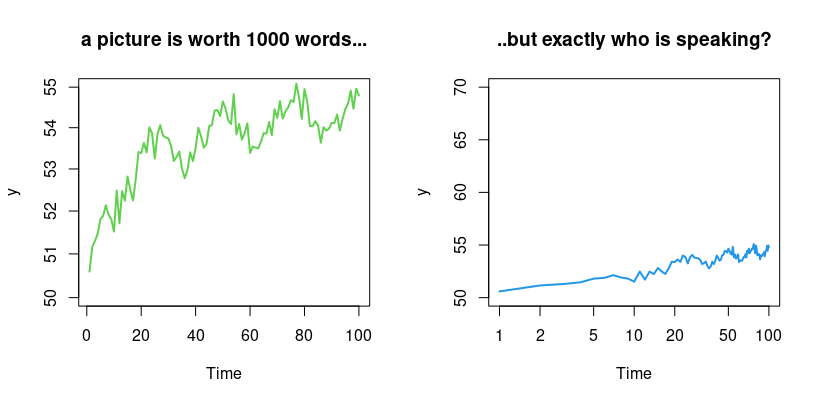

```r
rm(list = ls()); set.seed(3467); par(mfrow = c(1, 2))
n <- 100; tee <- (1:n)
y <- 50 + log(tee) + 0.5 * cos(.25 * tee) + rnorm(n, 0, .25)
plot.ts(y, col = 2, ylim = c(50, 55), log = "y", lwd = 2, main = "a picture is worth 1000 words...")
plot.ts(y, col = 4, ylim = c(50, 70), log = "x", lwd = 2, main = "..but exactly who is speaking?")
```

### Decomposing a time series

::::: slidebox
[What are the core components of a time series?]{.slide-label}

::: slide-body
A good way to start modelling a real-life univariate time series, $Y_t$, is to hypothesise that it is made up of additive components: $$ Y_t = \widetilde{T}_t + C_t + S_t + R_t, $$ where

- $\widetilde{T}_t$ is a deterministic **trend** (not necessarily linear, and it may change direction);
- $C_t$ is a **cyclical** component with oscillatory behaviour but no fixed frequency;
- $S_t$ is a **seasonal** recurrence pattern with a fixed period/frequency;
- $R_t$ is a stochastic **remainder** term (not necessarily stationary).

Hereafter, we consider trend and cycles-of-unknown-frequency jointly as a combined 'trend-cycle' component $T_t$, so the decomposition becomes $$ Y_t = T_t + S_t + R_t. $$
:::

::: slide-footer
Trend-cycle, seasonality, and a stochastic remainder: $Y_t = T_t + S_t + R_t$.
:::
:::::

An alternative is the **multiplicative** decomposition $Y_t = T_t \cdot S_t \cdot R_t$.

- An *additive* decomposition is more appropriate when the seasonal movements and stochastic fluctuations around the trend-cycle component **do not vary with the level** of the series.
- A *multiplicative* decomposition is more appropriate when they are **proportional to the level** of the series.

One can $\log$-linearise the multiplicative specification, $\log Y_t = \log T_t + \log S_t + \log R_t$, returning to the additive framework, so we will not discuss the multiplicative model further.

:::: {.callout-note collapse="true"}
## For reference (non-examinable) — Box–Cox / variance-stabilising transformations

Often, non-stationary processes exhibit changes in variance associated with changes in their mean levels. Consider a process $\{ Z_t \}$ with $\mathsf{Var}(Z_t) = c\, f(\mu_t)$, where $c$ is a positive finite constant, $\mu_t := \mathsf{E}(Z_t)$, and $f(\cdot)$ is a fixed (possibly non-linear) function. A first-order Taylor approximation, $T(Z_t) \approx T(\mu_t) + T'(\mu_t)(Z_t - \mu_t)$, gives $$ \mathsf{Var}[T(Z_t)] \approx [T'(\mu_t)]^2\, \mathsf{Var}(Z_t) = c\, [T'(\mu_t)]^2 f(\mu_t). $$ A variance-stabilising transformation therefore satisfies $T'(\mu_t) = 1/\sqrt{f(\mu_t)}$, i.e. $T(\mu_t) = \int 1/\sqrt{f(\mu_t)}\, \mathrm{d}\mu_t$. For example: if $\mathsf{Var}(Z_t) = c\mu_t^2$ then $T(\mu_t) = \log(\mu_t)$; if $\mathsf{Var}(Z_t) = c\mu_t$ then $T(\mu_t) = 2\sqrt{\mu_t}$; if $\mathsf{Var}(Z_t) = c\mu_t^4$ then $T(\mu_t) = -1/\mu_t$.

More generally, the **power transformation** of Box and Cox (1964) is $$ T(Z_t) = \begin{cases} \dfrac{Z_t^\lambda - 1}{\lambda}, & \lambda \neq 0, \\[4pt] \log(Z_t), & \lambda = 0, \end{cases} $$ which contains many of the above as special cases:

| Value of $\lambda$ | Transformation |
|:---:|:---:|
| $-1.0$ | $1/Z_t$ |
| $-0.5$ | $1/\sqrt{Z_t}$ |
| $0.0$ | $\log(Z_t)$ |
| $0.5$ | $\sqrt{Z_t}$ |
| $1.0$ | $Z_t$ |

These transformations are defined mainly for positive series (a constant can always be added without affecting the autocorrelation structure); a variance-stabilising transformation, if needed, should be performed *before* any other transformation such as first-differencing; and a Box–Cox transformation often also improves approximability by the normal distribution.
::::

#### Example of a time series decomposition

Suppose the time index $t = 1, 2, \ldots, 120$ represents the month. Consider the (toy) model below, which follows the $Y_t = T_t + S_t + R_t$ framework with a couple of extra complexities for interest.

::::: slidebox
[What is our model specification?]{.slide-label}

::: slide-body
Consider the toy model $$ Y_t = A_t + T_t + P_t + S_t + R_t, $$ where

- $A_t = 0$ for $t \leq 100$, and $A_t = -150$ thereafter (a **changepoint**);
- $T_t = -100 + 0.1 t + 0.02 t^2$ (a polynomial **trend**);
- $P_t = 15 \times \sin(2\pi t/12)$ (an annual **periodic** component);
- $S_t = 80 \times M_{12t}$, where $M_{12t}$ is a December dummy (**seasonal**);
- $R_t = 20 \times \widetilde{R}_t$, where $\widetilde{R}_t = 0.3\, \widetilde{R}_{t-1} + \varepsilon_t$ with $\varepsilon_t \sim \mathsf{WN}(0,1)$ (a stochastic **remainder**).
:::

::: slide-footer
A changepoint, a quadratic trend, a sinusoid, a Christmas dummy, and an $\mathsf{AR}(1)$ remainder.
:::
:::::

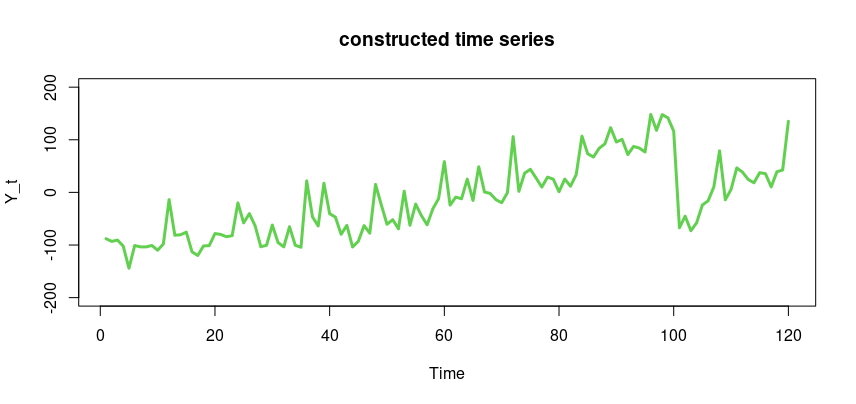

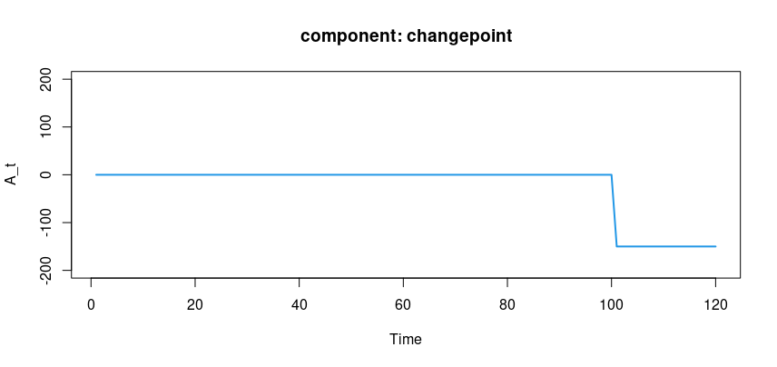

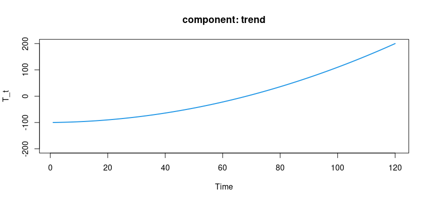

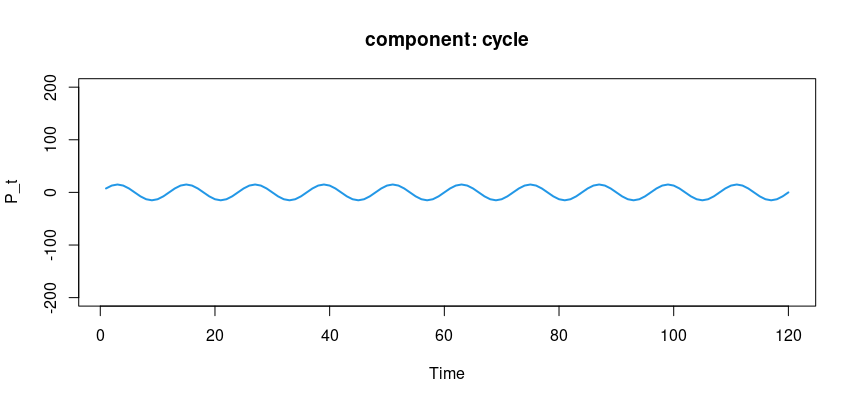

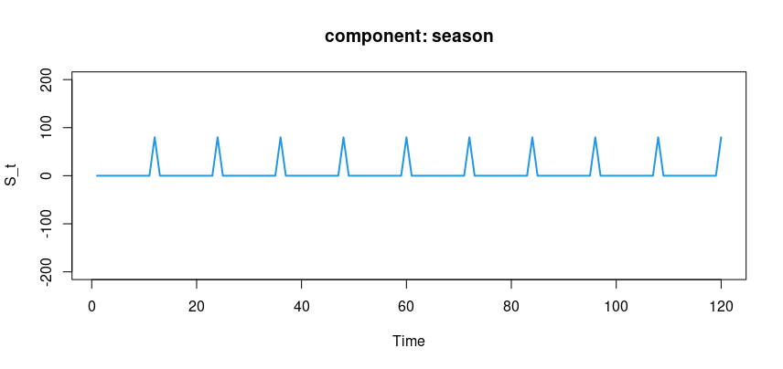

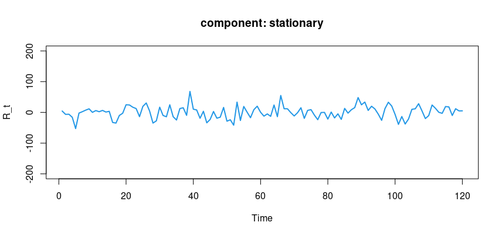

::::: slidebox
[What can we learn from the previous exercise?]{.slide-label}

::: slide-body
1. We possess a **vast array of modelling options** — lines, polynomials, indicators, sinusoids, etc. — to handle real-world departures from stationarity. And with the remainder term $R_t$, we still have the entire $\mathsf{ARMA}$ technology waiting to be harnessed.
2. We have not even mentioned the **important extension to the $\mathsf{ARMA}$ framework** via 'integrated' processes to accommodate stochastic trends — the $\mathsf{ARIMA}$ class, discussed next.
3. It does not take much sophistication to model relatively complicated-looking time series. In practice it is rare to need so many components at once: **parsimony remains achievable.**
4. Think about **transitioning from simulations to empirical investigations** (see below).
:::

::: slide-footer
We *re-composed* a series from building blocks; the econometrician must travel the other way — from data *down* to components.
:::
:::::

To further illustrate the suitability of our building blocks, consider a real-life example: the FTSE 100 index over time. The resemblance — in terms of broad stylistic features — between this graph and the toy example created "in the lab" is striking.

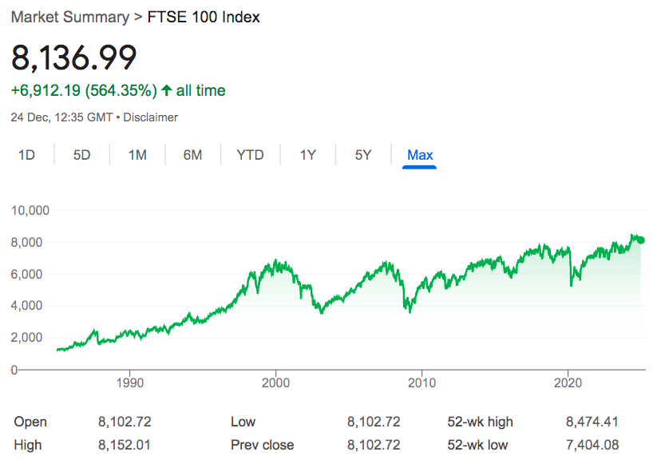

::::: slidebox
[The decomposition is sensible — but how do we operationalise it?]{.slide-label}

::: slide-body
In previous studies, we learned about regression models such as $Y_t = \beta_1 X_{1t} + \beta_2 X_{2t} + e_t$, where we use $X_{1t}$ and $X_{2t}$ to explain $Y_t$. A labour economist might use schooling and experience to explain wages.

But we are cold-hearted, mercenary time series analysts. To explain (say) the FTSE 100 index, we may choose the passage of time $X_{1t} = t$, a non-linear impact $X_{2t} = t^2$, a periodic waveform repeating every two years $X_{3t} = \sin(2\pi t/24)$, and a high-frequency noise component (e.g. via a highly negative $\mathsf{MA}$ coefficient) — jointly capturing trending, oscillating and idiosyncratic features. We pick a reasonably general specification of candidate regressors and let the data estimate the $\beta$ parameters, without structural shackles.
:::

::: slide-footer
*"You enjoy your Nobel prize, Prof., and I'll enjoy my pay cheque."*
:::
:::::

:::: {.callout-note collapse="true"}
## For MSc students (self-study) — Fisher's model for hidden periodicities

Consider a monthly series, observed over several years, obtained via extraction of a quadratic trend in the month. If there is additionally a periodic pattern, say annual, in the detrended data, the stationarity assumption remains violated. The classical way to deal with this is a model with a sinusoidal component: $$ Y_t = \beta_0 + \beta_1 t + \beta_2 t^2 + \gamma \cos(2\pi t/12) + \delta \sin(2\pi t/12) + \varepsilon_t. $$

The intuition: consider a general periodic function $R_j \cos(2\pi f_j t + \theta_j)$, where $\theta_j$ is the phase, $f_j$ the frequency, and $R_j$ the amplitude. Since $\cos(A+B) = \cos A \cos B - \sin A \sin B$, we can always write $$ R_j \cos(2\pi f_j t + \theta_j) = \gamma_j \cos(2\pi f_j t) + \delta_j \sin(2\pi f_j t), $$ where $\gamma_j = R_j \cos(\theta_j)$ and $\delta_j = -R_j \sin(\theta_j)$. Generalising the trend to a $k$th-order polynomial and the periodic part to several frequencies gives $$ \sum_{j=1}^{k} \big(\gamma_j \cos(2\pi f_j t) + \delta_j \sin(2\pi f_j t)\big), $$ for any $f_j \in (0, 1/2)$ (the upper limit $1/2$ is the Nyquist frequency — not examinable). These models are all amenable to standard regression analysis.

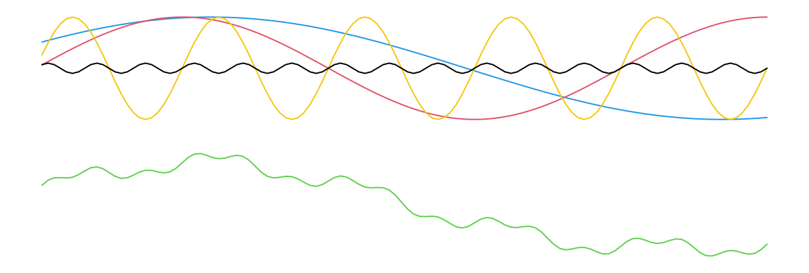
::::

## Trend-stationarity versus difference-stationarity

Recall our basic decomposition $Y_t = T_t + S_t + R_t$. From this point on, we no longer discuss $S_t$ — we focus on $T_t$ and $R_t$.

::::: slidebox
[What is a trend?]{.slide-label}

::: slide-body
- The precise definition of a 'trend' is somewhat elusive, and the word can mean different things in different contexts.
- In this course, a trend refers to either a 'deterministic' (predictable) **change in mean over time**, or a 'stochastic' (unpredictable) change in the process that manifests as an **increase in variance** over time.
:::

::: slide-footer
Deterministic trend = changing mean; stochastic trend = growing variance.
:::
:::::

::::: slidebox
[What is a deterministic trend?]{.slide-label}

::: slide-body
We model deterministic trends using polynomials in $t$: $$ Y_t = \underbrace{\alpha_0 + \alpha_1 t + \alpha_2 t^2 + \cdots + \alpha_k t^k}_{T_t \text{ term}} + \underbrace{\varepsilon_t}_{R_t \text{ term}}, $$ where $\varepsilon_t \sim \mathsf{WN}(0,\sigma_{\varepsilon}^2)$. In most economic and financial settings, $k = 0, 1, 2$, or occasionally $3$, will suffice.

For $k = 1$ (a linear trend), $\mathsf{E}(Y_t) = \alpha_0 + \alpha_1 t$, which is time-varying with period-on-period change $\alpha_1$. The series **drifts every period by a predictable amount**: $$\begin{aligned} Y_1 &= \alpha_0 + \alpha_1 + \varepsilon_1 \\ Y_2 &= \alpha_0 + \alpha_1 + \alpha_1 + \varepsilon_2 \\ &\ \vdots \\ Y_t &= \alpha_0 + \underbrace{\alpha_1 + \alpha_1 + \cdots + \alpha_1}_{\text{accumulation of } t \text{ terms}} + \varepsilon_t. \end{aligned}$$
:::

::: slide-footer
A predictable, period-on-period drift in the mean.
:::
:::::

::::: slidebox
[What is a stochastic trend? (1 of 4: Overview)]{.slide-label}

::: slide-body
- Recall our general approach: $Y_t = T_t + R_t$.
- To accommodate a **deterministic** trend, we introduce it via the $T_t$ component.
- To accommodate a **stochastic** trend, we do it via the stochastic $R_t$ component (not the deterministic $T_t$). How? In short, we model $R_t$ as an $\mathsf{ARIMA}$ process. But first we need to (i) build intuition for what a stochastic trend is, and (ii) learn new vocabulary ('integrated' processes).
:::

::: slide-footer
Stochastic trends live in $R_t$, modelled via $\mathsf{ARIMA}$.
:::
:::::

::::: slidebox
[What is a stochastic trend? (2 of 4: Intuition)]{.slide-label}

::: slide-body
- Many real-life economic series are non-stationary, but the precise nature of the instability is not necessarily predictable. In economics and finance, deterministic trends might be the exception rather than the norm.
- A deterministic trend is relatively easy to handle — a non-random function of time. These may appear in the hard sciences (astronomy, engineering, etc.).
- But in the social sciences, just because a segment of the series looks approximately linear, do we believe the linearity is intrinsic and will persist forever?
- A series with a **stochastic trend** may exhibit prolonged long-run increases, then prolonged declines, then another period of increases (perhaps at a different growth rate). This seems more representative of social-science time series.
:::

::: slide-footer
Stochastic trends wander; they need not persist in any fixed direction.
:::
:::::

While drafting this section, Enders' *Applied Econometric Time Series* (4th edn., 2014–2015) provided an apt example — a graph of US GDP using data up to 2012.

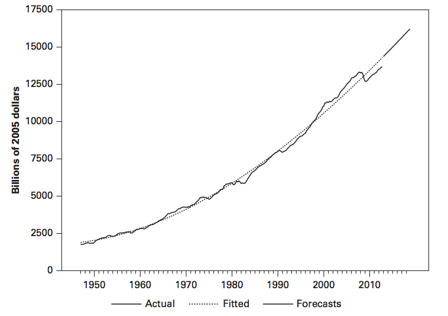

Enders writes (p.182): *"…the implications [of imposing a deterministic trend] for the behavior of the business cycle are not credible. The deterministic trend implies that, whenever real GDP is below trend, in subsequent periods, there will be unusually high growth as real GDP returns to the trend. The reaction to the 2007–2008 financial crisis suggests that most economists and politicians do not take this notion very seriously."* Indeed, there was no immediate upward correction in the years after the crisis — the downward shock persisted.

::::: slidebox
[What is a stochastic trend? (3 of 4: Graph)]{.slide-label}

::: slide-body
Below are sample paths of a random walk, to show **how a stochastic trend looks**. Notice there is no tendency for mean-reversion, and the non-stationarity is completely unpredictable.
:::

::: slide-footer
No mean reversion — the walk can wander arbitrarily far from where it started.
:::
:::::

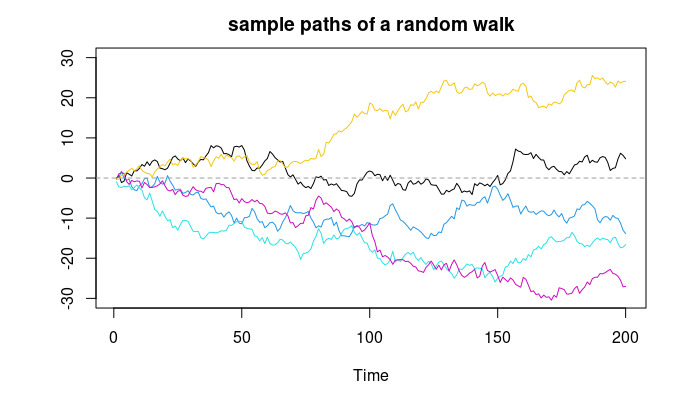

::::: slidebox
[What is a stochastic trend? (4 of 4: Algebra)]{.slide-label}

::: slide-body
Consider the random walk (the simplest model of a stochastic trend), $Y_t = Y_{t-1} + \varepsilon_t$, with $\varepsilon_t$ noise, $t > 0$ and $Y_0 = \alpha_0$. Lagging and substituting $t-1$ times gives $$ Y_t = \alpha_0 + \underbrace{\varepsilon_1 + \varepsilon_2 + \cdots + \varepsilon_t}_{\text{accumulation of } t \text{ terms}}. $$

- In *both* the deterministic- and stochastic-trend cases, $Y_t$ accumulates $t$ terms whose effects persist forever (coefficients of one).
- In the deterministic case, the accumulation is a perfectly predictable drift ($\alpha_1$ each period), so $\mathsf{E}(Y_t) = \alpha_0 + t\alpha_1$.
- In the stochastic case, the accumulation is a completely unpredictable amount each period ($\varepsilon_1, \varepsilon_2, \ldots$). The expectation stays put: $\mathsf{E}(Y_t) = \alpha_0$. There is no drift as such, but a great deal of (growing) uncertainty.
- Indeed, while a deterministic trend gives period-on-period growth in the expected value, **a stochastic trend gives growth in the variance:** $$ \mathsf{Var}(Y_t) = \mathsf{Var}(\alpha_0 + \varepsilon_1 + \cdots + \varepsilon_t) = t \cdot \sigma^2_{\varepsilon}. $$
:::

::: slide-footer
Random walk: constant mean $\alpha_0$, but variance $t\sigma^2_\varepsilon$ that grows without bound.
:::
:::::

::::: slidebox
[Can we see both models (plus one!) on a single slide?]{.slide-label}

::: slide-body
**Model 1** (noise about a **linear trend**): $Y_t = \alpha_0 + \alpha_1 t + \varepsilon_t$, giving $\mathsf{E}(Y_t) = \alpha_0 + t\alpha_1$ and $\mathsf{Var}(Y_t) = \sigma^2_{\varepsilon}$.

**Model 2** (the **random walk**): $Y_t = Y_{t-1} + \varepsilon_t$ with $Y_0 = \alpha_0$. Lagging and substituting, $Y_t = \alpha_0 + \varepsilon_1 + \cdots + \varepsilon_t$, giving $\mathsf{E}(Y_t) = \alpha_0$ and $\mathsf{Var}(Y_t) = t\sigma^2_{\varepsilon}$.

**Model 3** (the **random walk with drift**): $Y_t = \alpha_1 + Y_{t-1} + \varepsilon_t$ with $Y_0 = \alpha_0$. Lagging and substituting, $$ Y_t = \alpha_0 + \underbrace{\alpha_1 + \cdots + \alpha_1}_{t \text{ terms}} + \underbrace{\varepsilon_1 + \cdots + \varepsilon_t}_{t \text{ terms}}. $$ (Work out the moments yourself.)
:::

::: slide-footer
Deterministic drift grows the mean; the random-walk accumulation grows the variance.
:::
:::::

::::: slidebox
[What is trend-stationarity versus difference-stationarity?]{.slide-label}

::: slide-body
- A non-stationary time series is **trend-stationary** if it can be made stationary by deducting a deterministic trend (typically a polynomial in $t$).
- A non-stationary time series is **difference-stationary** if it contains a stochastic trend (which cannot be eliminated by deducting a polynomial in $t$) but can be made stationary by first-differencing.
:::

::: slide-footer
Trend-stationary: de-trend. Difference-stationary: difference.
:::
:::::

::::: slidebox
[Examples of trend-stationarity and difference-stationarity]{.slide-label}

::: slide-body
- In **Model 1**, $y_t := Y_t - \alpha_0 - \alpha_1 t$ is stationary (just noise). So we estimate $\alpha_0, \alpha_1$ and de-trend $Y_t$. (Model 1 is **trend-stationary**.)
- In **Model 2**, $y_t = Y_t - Y_{t-1} = \Delta Y_t$ is stationary (just noise). So we first-difference. Here, deducting a polynomial in $t$ will **not** make the model stationary, because the variance still grows. (Model 2 is **difference-stationary**.)
- The jargon is not always defined precisely or used uniformly throughout the literature. (Decide for yourself whether Model 3 is trend- or difference-stationary.)
:::

::: slide-footer
Match the cure to the disease: de-trend a deterministic trend, difference a stochastic one.
:::
:::::

::::: slidebox
[First-differencing "to play it safe"?]{.slide-label}

::: slide-body
Model 1 can *also* be made stationary by first-differencing. From $Y_t = \alpha_0 + \alpha_1 t + \varepsilon_t$, $$\begin{aligned} \Delta Y_t &= (\alpha_0 + \alpha_1 t + \varepsilon_t) - (\alpha_0 + \alpha_1(t-1) + \varepsilon_{t-1}) \\ &= \alpha_1 + \Delta\varepsilon_t, \end{aligned}$$ which is stationary (a constant plus an $\mathsf{MA}(1)$ process). It may therefore seem smart to difference every series with wild abandon to guarantee stationarity. However, **over-differencing is not a good idea.** (You will explore the reason in a problem set.)
:::

::: slide-footer
You *can* difference a trend-stationary series, but you shouldn't — over-differencing has costs.
:::
:::::

:::: {.callout-note collapse="true"}
## Watch: deterministic vs stochastic trends

::: {.content-visible when-format="html"}
```{shinylive-r}
#| standalone: true
#| viewerHeight: 540

library(shiny)

ui <- fluidPage(
  tags$style(HTML("body{font-family:system-ui,sans-serif;}")),
  titlePanel("Three trend models"),
  sidebarLayout(
    sidebarPanel(
      sliderInput("T",     "Sample size T", 50, 500, 200, 50),
      sliderInput("drift", "Drift / slope alpha_1", 0, 1, 0.3, 0.1),
      sliderInput("sig",   "Noise sd sigma", 0.5, 5, 1, 0.5),
      sliderInput("seed",  "Random seed", 1, 100, 7, 1)
    ),
    mainPanel(plotOutput("plot", height = "440px"))
  )
)

server <- function(input, output) {
  output$plot <- renderPlot({
    set.seed(input$seed)
    n <- input$T; e <- rnorm(n, 0, input$sig)
    linear <- input$drift * (1:n) + e                 # Model 1: linear trend + noise
    rw     <- cumsum(e)                               # Model 2: random walk
    rwd    <- input$drift * (1:n) + cumsum(e)         # Model 3: random walk with drift
    matplot(1:n, cbind(linear, rw, rwd), type = "l", lty = 1, lwd = 2,
            col = c(4, 2, 3), xlab = "t", ylab = expression(Y[t]))
    legend("topleft", c("linear trend + noise", "random walk", "random walk w/ drift"),
           col = c(4, 2, 3), lwd = 2, bty = "n")
  })
}

shinyApp(ui, server)
```
:::
::::

## Defining $\mathsf{ARIMA}$ models

We finally come to the core slide of this topic — perhaps of the entire course. Without further delay, the celebrated $\mathsf{ARIMA}$ class of models.

::::: slidebox
[What are $\mathsf{ARIMA}$ models? (What are integrated processes?)]{.slide-label}

::: slide-body
We have studied the importance of $\mathsf{ARMA}$ models for stationary time series. A generalisation incorporating a wide range of non-stationary series is the $\mathsf{ARIMA}$ class — processes which, after differencing finitely many times, reduce to $\mathsf{ARMA}$ processes.

**Definition.** $Y_t$ is said to be an $\mathsf{ARIMA}(p,d,q)$ process if $Z_t := \Delta^d Y_t$ is a causal stationary $\mathsf{ARMA}(p,q)$ process, where $d$ is a non-negative finite integer. $\qquad\square$

- This means $\{Y_t\}$ satisfies $$ \Phi(L)(1-L)^d Y_t = \Theta(L)\varepsilon_t, $$ where, for $z \in \mathbb{C}$, $\Phi(z)$ and $\Theta(z)$ are polynomials of orders $p$ and $q$, $\Phi(z) \neq 0$ for $|z| \leq 1$, and $\varepsilon_t \sim \mathsf{WN}(0,\sigma_{\varepsilon}^2)$.
- The process $Y_t$ is said to be (stochastically) **integrated of order $d$**, or $\mathsf{I}(d)$ for short.
:::

::: slide-footer
Difference $d$ times and you are back to a stationary $\mathsf{ARMA}(p,q)$.
:::
:::::

## The Dickey–Fuller test for a unit root

::::: slidebox
[Where are we in our modelling strategy?]{.slide-label}

::: slide-body
Suppose we have a univariate time series, $Y_t$.

- First, plot and inspect the data.
- Next, think about the key deterministic components ($T_t, S_t, \ldots$) and the stochastic remainder $R_t$.
- We hypothesise that $R_t$ belongs to the $\mathsf{ARIMA}(p,d,q)$ class; our focus is now on identifying $p, d, q$. Identifying $d$ takes precedence, because we want to work towards a stationary remainder we can model with $\mathsf{ARMA}$ technology. The concern is that $R_t$ may still contain a stochastic trend.
- This is where the **Dickey–Fuller (DF) test** enters: it tests for the presence of a stochastic trend in $Y_t$.
:::

::: slide-footer
Identify $d$ first — strip out any stochastic trend before $\mathsf{ARMA}$ modelling.
:::
:::::

Approximate linear decay of the sample ACS is often taken as a symptom of non-stationarity requiring differencing, but visual inspection is subjective. It is useful to quantify evidence of a stochastic trend. We study the unit root test due to Dickey & Fuller (1979) — not the only test for non-stationarity, but certainly the most well-known.

::::: slidebox
[What is the intuition behind the DF test? (1 of 2)]{.slide-label}

::: slide-body
Consider an $\mathsf{AR}(1)$ model with a constant (for generality): $$ Y_t = \beta_0 + \phi Y_{t-1} + \varepsilon_t, \quad \varepsilon_t \sim \mathsf{WN}(0,\sigma^2_{\varepsilon}). $$ Subtracting $Y_{t-1}$ from both sides re-expresses it as $$ \Delta Y_t = \beta_0 + (\phi - 1) Y_{t-1} + \varepsilon_t. $$
:::

::: slide-footer
Rewrite the $\mathsf{AR}(1)$ in 'differences' form — the coefficient on $Y_{t-1}$ becomes $\phi - 1$.
:::
:::::

::::: slidebox
[What is the intuition behind the DF test? (2 of 2)]{.slide-label}

::: slide-body
Write the equation as $$ \Delta Y_t = \beta_0 + \beta_1 Y_{t-1} + \varepsilon_t, \tag{1} $$ where $\beta_1 := \phi - 1$.

- If we restrict $\beta_0 = \beta_1 = 0$, equation (1) reduces to $\Delta Y_t = \varepsilon_t$ — a random walk, $Y_t = Y_{t-1} + \varepsilon_t$.
- If instead we allow $\beta_0 \neq 0$ and $-2 < \beta_1 < 0$, equation (1) corresponds to a causal stationary $\mathsf{AR}(1)$ process.

This logic motivates the test procedure.
:::

::: slide-footer
A unit root means $\beta_1 = 0$; stationarity means $\beta_1 < 0$.
:::
:::::

:::: {.callout-note collapse="true"}
## The 10-step hypothesis-test recipe

1. **Assumptions** (arguably the most critical step, since it affects many steps below).
2. **Hypotheses** (a clear statement of the null $H_0$ and the alternative $H_1$).
3. **Test statistic, $V$** (a function of the data carrying information about $H_0$).
4. **Distribution of $V$ under $H_0$ and the assumptions** (usually one of $\mathcal{N}(0,1)$, $t$, $\chi^2$ or $F$).
5. **Significance level** (some exogenously chosen $\alpha \in (0,1)$, typically small).
6. **Critical value** (usually from a statistical table).
7. **Rejection rule** (a region in the domain of the PDF of $V$ where we reject $H_0$).
8. **Computed value of $V$**.
9. **Test result** (compare against the rejection rule; you never *accept* $H_0$ — you reject or fail to reject, at a stated significance level, or report a $p$-value).
10. **Interpretation** (framing the result back in terms of the underlying context).
::::

**The restricted parameter space.** To understand *why* we pick the specific nulls and alternatives we do, consider the first-order autoregression $$ Y_t = \beta_0 + \phi Y_{t-1} + \alpha_1 t + \varepsilon_t, $$ with possible values $-1 < \phi < 1$ or $\phi = 1$, and $\alpha_1 = 0$ or $\alpha_1 \neq 0$. (We exclude $\phi > 1$ as non-causal, and $\phi \le 1$ values that imply nonsensical economic models.) The cases that arise are:

- **Case (a):** $-1 < \phi < 1$, $\alpha_1 = 0$ (no restriction on $\beta_0$) — a causal $\mathsf{AR}(1)$: $Y_t = \beta_0 + \phi Y_{t-1} + \varepsilon_t$.
- **Case (b):** $\beta_0 = 0$, $\phi = 1$, $\alpha_1 = 0$ — a random walk: $Y_t = Y_{t-1} + \varepsilon_t$.
- **Case (c):** $\beta_0 \neq 0$, $\phi = 1$, $\alpha_1 = 0$ — a random walk with drift: $Y_t = \beta_0 + Y_{t-1} + \varepsilon_t$.
- **Case (d):** $-1 < \phi < 1$, $\alpha_1 \neq 0$ — a causal $\mathsf{AR}(1)$ around a deterministic linear trend: $Y_t = \beta_0 + \phi Y_{t-1} + \alpha_1 t + \varepsilon_t$.
- **Case (e):** $\phi = 1$, $\alpha_1 \neq 0$ — extremely non-stationary (a random walk with drift around a deterministic linear trend); **excluded** as unlikely in practice.

We take a pragmatic approach: plot the data and assess whether there is evidence of drift. If not, we limit the investigation to Cases (a) and (b); if so, we consider Cases (c) and (d).

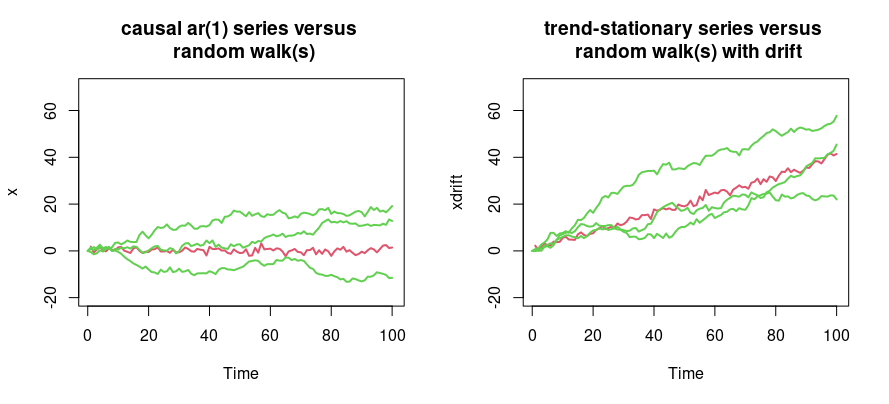

::::: slidebox
[The DF test (Case 1)]{.slide-label}

::: slide-body
This first case corresponds to the *left* panel above.

1. **Assumptions.** $\Delta Y_t = \beta_0 + \beta_1 Y_{t-1} + \varepsilon_t$, where $\varepsilon_t \sim iid(0,\sigma^2_{\varepsilon})$, $t > 0$, $Y_0 = 0$.
2. **Hypotheses.** $H_0: \beta_1 = 0$, $H_1: \beta_1 < 0$. (In principle we should jointly test $(\beta_0 = 0, \beta_1 = 0)$ versus $(\beta_0 \neq 0, \beta_1 < 0)$, but it is common to focus on the single parameter.)
3. **Test statistic.** $V = \widehat{\beta}_1 / \mathrm{SE}(\widehat{\beta}_1)$.
4. **Distribution of $V$ under $H_0$.** See Dickey & Fuller (1979) — **STOP!**
:::

::: slide-footer
The statistic looks like a $t$-ratio — but its distribution is *not* the usual one.
:::
:::::

::::: slidebox
[The crux of the matter]{.slide-label}

::: slide-body
Because the null is one of non-stationarity, all standard asymptotic results (such as the CLT) fail. A key contribution of this literature is that the test statistic $V$ is **not asymptotically normal**. The limiting distribution is known but has **no closed-form expression**: its quantiles (critical values) must be derived numerically, via simulation. These critical values are in Fuller (1976). (Once we have them, steps 5–10 of the test are unremarkable.)
:::

::: slide-footer
Non-stationarity under $H_0$ breaks the CLT — hence the bespoke Dickey–Fuller distribution.
:::
:::::

::::: slidebox
[What are the critical values for the DF test statistic?]{.slide-label}

::: slide-body
The limiting distribution is the **Dickey–Fuller distribution**. Since there is no closed form, quantiles are computed by simulation:

| Sample size | Without trend (1%) | Without trend (5%) | With trend (1%) | With trend (5%) |
|:---:|:---:|:---:|:---:|:---:|
| $T = 25$ | $-3.75$ | $-3.00$ | $-4.38$ | $-3.60$ |
| $T = 50$ | $-3.58$ | $-2.93$ | $-4.15$ | $-3.50$ |
| $T = 100$ | $-3.51$ | $-2.89$ | $-4.04$ | $-3.45$ |
| $T = 250$ | $-3.46$ | $-2.88$ | $-3.99$ | $-3.43$ |
| $T = 500$ | $-3.44$ | $-2.87$ | $-3.98$ | $-3.42$ |
| $T = \infty$ | $-3.43$ | $-2.86$ | $-3.96$ | $-3.41$ |

*Source: Fuller (1976), Introduction to Statistical Time Series, p.373.*

- The distribution is skewed to the left, so critical values are smaller than for the standard normal.
- For 'Case 1', use the 'Without trend' panel.
- At 5% in a one-tailed test of $H_0: \beta_1 = 0$ against $H_1: \beta_1 < 0$, the correct large-sample critical value is $-2.86$ rather than $-1.65$. Using standard normal tables, you may reject a unit root too often.
:::

::: slide-footer
You need not memorise the table — it will be provided in the exam if required.
:::
:::::

::::: slidebox
[The DF test (Case 2)]{.slide-label}

::: slide-body
The 'With trend' part of the table covers the case where we suspect drift or non-stochastic trending behaviour (the *right* panel of the figure). Critical values change, but the other aspects of the procedure carry over analogously.

A concise explanation (SS, 3rd edn., pp. 279–280): *One can extend the model to include a non-stochastic trend, e.g. $x_t = \beta_0 + \beta_1 t + \phi x_{t-1} + w_t$. If we cannot assume $\beta_1 = 0$, the interest is testing the null that $(\beta_1, \phi) = (0, 1)$ simultaneously, versus the alternative that $\beta_1 \neq 0$ and $|\phi| < 1$. In this case the null is that the process is a random walk with drift, versus the alternative that it is stationary around a global trend.*
:::

::: slide-footer
With a trend, test $(\beta_1, \phi) = (0,1)$ jointly — and use the 'With trend' critical values.
:::
:::::

::::: slidebox
[What is the augmented DF test?]{.slide-label}

::: slide-body
A quote from Wooldridge, *Introductory Econometrics* (p. 576): *More generally, we can add $p$ lags of $\Delta y_t$ to the equation to account for the dynamics in the process. We run the regression of $\Delta y_t$ on $y_{t-1}, \Delta y_{t-1}, \ldots, \Delta y_{t-p}$ and carry out the test on the coefficient on $y_{t-1}$, just as before. This extended version is usually called the augmented Dickey–Fuller test because the regression has been augmented with the lagged changes $\Delta y_{t-h}$. The critical values and rejection rule are the same as before. The inclusion of the lagged changes is intended to clean up any serial correlation in $\Delta y_t$. The more lags we include, the more initial observations we lose.*
:::

::: slide-footer
Augment with lagged differences to mop up serial correlation; test on $y_{t-1}$ as before.
:::
:::::

:::: {.callout-note collapse="true"}
## For MSc students — *why* the augmented DF test works

The Wooldridge explanation is correct but does not explain *why* throwing in lagged differences works. Here we explore exactly what the augmented DF (ADF) test is.

Say we have an $\mathsf{AR}(3)$ process $y_t = \alpha_0 + \alpha_1 y_{t-1} + \alpha_2 y_{t-2} + \alpha_3 y_{t-3} + \varepsilon_t$, with $\varepsilon_t \sim iid(0,\sigma_{\varepsilon}^2)$. Denote the $\mathsf{AR}$ polynomial by $\mathbf{A}_3(L) = 1 - \alpha_1 L - \alpha_2 L^2 - \alpha_3 L^3$. Two key insights:

(i) The $\mathsf{AR}$ polynomial may be expressed as $$\begin{aligned} \mathbf{A}_3(L) &= 1 - \alpha_1 L - \alpha_2 L^2 - \alpha_3 L^3 \\ &= 1 - (\alpha_1 + \alpha_2 + \alpha_3) L + (\alpha_2 + \alpha_3)(1-L) L + \alpha_3 (1-L) L^2. \end{aligned}$$
(ii) Under the restriction $\alpha_1 + \alpha_2 + \alpha_3 = 1$, we have $\mathbf{A}_3(1) = 1 - (\alpha_1 + \alpha_2 + \alpha_3) = 0$. So $\alpha_1 + \alpha_2 + \alpha_3 = 1$ is a condition for the process to be $\mathsf{I}(1)$.

In other words, under $H_0: \alpha_1 + \alpha_2 + \alpha_3 = 1$, there always exists a $\mathbf{B}_2(L)$ such that $\mathbf{A}_3(L) = \mathbf{B}_2(L)(1-L)$. The implication is that the $\mathsf{AR}(3)$ model can be written as $$ y_t = \alpha_0 + (\alpha_1 + \alpha_2 + \alpha_3)y_{t-1} - (\alpha_2 + \alpha_3)\Delta y_{t-1} - \alpha_3 \Delta y_{t-2} + \varepsilon_t, $$ which re-parametrises (subtracting $y_{t-1}$ from both sides) to $$ \Delta y_t = \beta_0 + \beta_1 y_{t-1} + \beta_2 \Delta y_{t-1} + \beta_3 \Delta y_{t-2} + \varepsilon_t, $$ where $\beta_0 = \alpha_0$, $\beta_1 = \alpha_1 + \alpha_2 + \alpha_3 - 1$, $\beta_2 = -(\alpha_2 + \alpha_3)$, $\beta_3 = -\alpha_3$. We test $H_0: \beta_1 = 0$ against $H_1: \beta_1 < 0$. Under the null and alternative, respectively, $$ \Delta y_t = \beta_2 \Delta y_{t-1} + \beta_3 \Delta y_{t-2} + \varepsilon_t \quad\text{ and }\quad \Delta y_t = \beta_0 + \beta_1 y_{t-1} + \beta_2 \Delta y_{t-1} + \beta_3 \Delta y_{t-2} + \varepsilon_t, $$ and the usual hypothesis-testing recipe applies.
::::

:::: {.callout-note collapse="true"}
## Watch: the Dickey–Fuller statistic is not normal

::: {.content-visible when-format="html"}
```{shinylive-r}
#| standalone: true
#| viewerHeight: 540

library(shiny)

ui <- fluidPage(
  tags$style(HTML("body{font-family:system-ui,sans-serif;}")),
  titlePanel("Sampling distribution of the DF statistic"),
  sidebarLayout(
    sidebarPanel(
      sliderInput("phi", "AR(1) coefficient phi (1 = unit root)", 0.5, 1.0, 1.0, 0.05),
      sliderInput("T",   "Series length T", 50, 300, 100, 50),
      sliderInput("reps","Monte Carlo replications", 200, 2000, 800, 200)
    ),
    mainPanel(plotOutput("plot", height = "440px"))
  )
)

server <- function(input, output) {
  output$plot <- renderPlot({
    stat <- replicate(input$reps, {
      y  <- numeric(input$T)
      e  <- rnorm(input$T)
      for (t in 2:input$T) y[t] <- input$phi * y[t - 1] + e[t]
      dy <- diff(y); ylag <- y[-input$T]
      fit <- lm(dy ~ ylag)
      coef(summary(fit))["ylag", "t value"]
    })
    hist(stat, breaks = 40, freq = FALSE, col = "grey85", border = "white",
         main = "DF statistic vs standard normal", xlab = "beta1-hat / SE")
    curve(dnorm(x), add = TRUE, col = 2, lwd = 2)
    abline(v = -2.86, col = 4, lwd = 2, lty = 2)
    legend("topleft", c("N(0,1)", "5% DF crit. (-2.86)"),
           col = c(2, 4), lwd = 2, lty = c(1, 2), bty = "n")
  })
}

shinyApp(ui, server)
```
:::
::::

## Wrap-up

::::: slidebox
[Where are we in our modelling strategy?]{.slide-label}

::: slide-body
Suppose we have a univariate time series, $Y_t$.

- First, plot and inspect the data.
- Next, think about the key deterministic components ($T_t, S_t, \ldots$) and the stochastic remainder $R_t$.
- Hypothesise that $R_t$ belongs to the $\mathsf{ARIMA}(p,d,q)$ class; focus on identifying $d$ first, working towards a stationary remainder for $\mathsf{ARMA}$ modelling.
- The DF test tests for a stochastic trend. Pick a large $p_{\max}$, tentatively hypothesise an $\mathsf{AR}(p_{\max})$ model, and carry out an **augmented DF test**.
- If we fail to reject the null of non-stationarity, first-difference the data and repeat. (One or two first-differences should be plenty — avoid unnecessary over-differencing.)
- Once we reject the null, deploy the full model-fitting procedure for stationary processes (Topic 5).

This strategy is not universal — just one reasonably sensible plan for starting out.
:::

::: slide-footer
Plot → decompose → identify $d$ (via ADF) → difference if needed → fit a stationary $\mathsf{ARMA}$.
:::
:::::

------------------------------------------------------------------------

## Review questions

1.  Suppose you have monthly data on sales of woolly jumpers, $Y_t$. Your boss wants you to regress $Y_t$ on four quarterly dummies, $Y_t = \delta_1 + \delta_2 Q2_t + \delta_3 Q3_t + \delta_4 Q4_t + e_t$, with the restriction that the winter boost in Q4 is identical to the summer drop in Q3. How would you implement this request?
2.  What is the difference between a deterministic and a stochastic trend? Provide minimum working examples of processes characterised by each type of trend.
3.  Consider $Y_t = 2Y_{t-1} - Y_{t-2} + \varepsilon_t$, for $\varepsilon_t \sim \mathsf{WN}(0,\sigma^2_{\varepsilon})$. Your friend says that $Y_t \sim \mathsf{ARIMA}(2,0,0)$. Why is this incorrect?
4.  How would you recap the full 10-step DF test procedure for a tutorial group? (Write each step down explicitly for your own revision.)

------------------------------------------------------------------------

## Further reading

- See **SS, Chapters 1 and 5** (Dickey–Fuller / unit roots in SS Chapter 5.2; critical values from Fuller (1976)).

------------------------------------------------------------------------
