<!-- git add . && git commit -m "update" && git push  -->

[Goals]{.kicker}

- To introduce forecasting with simple (but sensible) common-sense methods and motivate when they suffice.
- To understand forecasting as signal extraction, and to diagnose forecast quality via residuals and out-of-sample testing.
- To establish that the optimal (minimum mean-square-error) forecast is the conditional expectation.
- To derive point forecasts and forecast-error variances in the $\mathsf{AR}(1)$, $\mathsf{MA}(1)$, $\mathsf{ARMA}(1,1)$ and $\mathsf{ARIMA}(1,1,1)$ cases.

[Key Concept]{.kicker}

The optimal forecast of $Y_{t+h}$ is the conditional expectation, $\mathsf{E}(Y_{t+h} \mid \mathcal{F}_t)$.

> *The introductory sections and many R examples in this topic are borrowed and adapted from Hyndman & Athanasopoulos, [Forecasting: Principles and Practice (2021), 3rd edition](https://otexts.com/fpp3/) — referred to hereafter as 'FPP'.*

------------------------------------------------------------------------

## Introduction

Although the creation of good parameter estimates is often viewed as the primary goal of econometrics (e.g. to assist with causal inference), to many researchers and practitioners (e.g. in finance and macroeconomics) a goal of equal — if not greater — importance is the creation of good **forecasts**. Forecasting is about predicting the future as accurately as possible, given all information available, including present and historical data and any *a priori* knowledge of relevant future events. By definition, forecasting is an out-of-sample prediction endeavour.

The terminology is not universal, but here is how we use certain keywords. **Prediction** is the umbrella term:

- *In-sample* prediction yields **fitted values**.
- *Out-of-sample* prediction is either **pre-sample** (yielding **backcast values**) or **post-sample** (yielding **forecast values** — our focus).

It is useful to keep these distinctions in mind: the model that best fits the sample need not yield the best forecasts when tested, and the model with the best short-term forecasts need not be optimal at longer horizons. In this topic we introduce forecasting with simple methods, then leverage everything from earlier topics to discuss how to (i) model the trend-cycle, seasonal and (difference-)stationary components; (ii) estimate any parameters; (iii) create point forecasts at various horizons; (iv) quantify forecast uncertainty; and (v) test forecast performance.

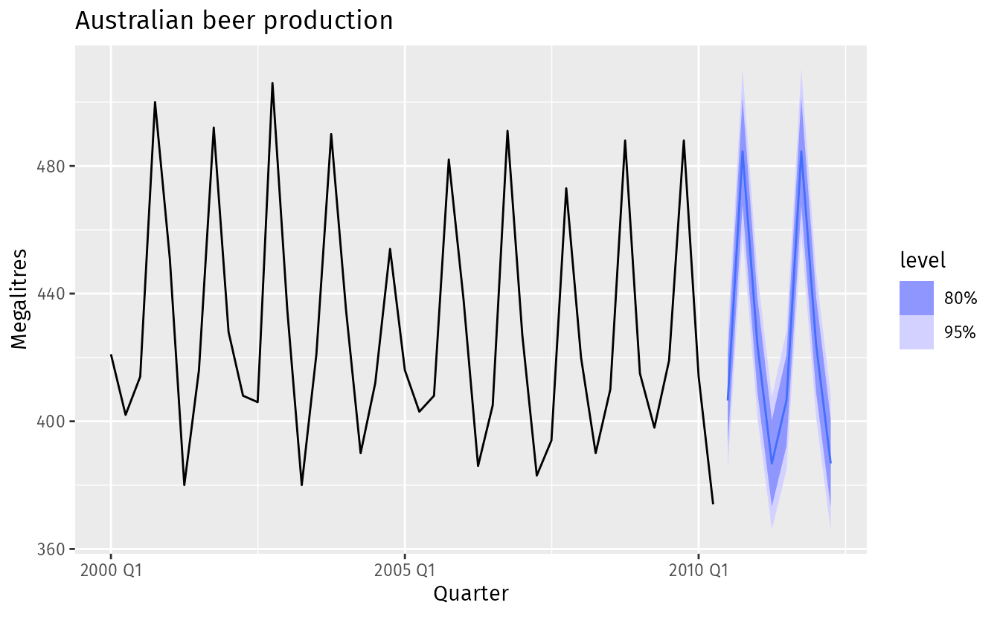

The figure above is an example of the end-product we hope to create. But how do we start? Before any forecasting exercise it is vital to understand the data — inspect it, and possibly speak to those who generated it. Are there obvious patterns? A clear trend? Is seasonality important? Is there evidence of business cycles? Are there gaps or outliers needing expert explanation? Such exploratory analysis helps ensure that we (i) capture genuine patterns for extrapolation; (ii) do not replicate random fluctuations or one-off past events; and (iii) do not let slip common sense in pursuit of technical sophistication.

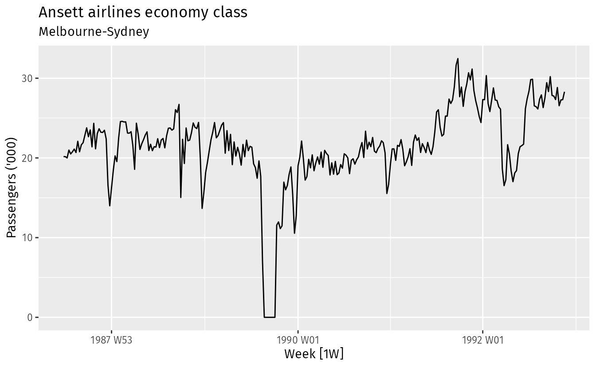

The plot above immediately reveals some interesting features:

1. A period in 1989 with no passengers, due to an industrial dispute.
2. A period of reduced load in 1992, due to a trial replacing some economy seats with business class.
3. A large increase in passenger load in the second half of 1991.
4. Large dips around the start of each year, due to holiday effects.
5. A long-term fluctuation in the level of the series.

Any modeller must take these features into account (whether for incorporation or omission) to forecast effectively.

:::: {.callout-note collapse="true"}
## FPP on being realistic — what is forecastable?

*Some things are easier to forecast than others. The time of the sunrise tomorrow morning can be forecast precisely. On the other hand, tomorrow's lotto numbers cannot be forecast with any accuracy. The predictability of an event or a quantity depends on several factors including: (1) how well we understand the factors that contribute to it; (2) how much data is available; (3) how similar the future is to the past; and (4) whether the forecasts can affect the thing we are trying to forecast.*

*For example, short-term forecasts of residential electricity demand can be highly accurate because all four conditions are usually satisfied… On the other hand, when forecasting currency exchange rates, only one of the conditions is satisfied: there is plenty of available data. However, we have a limited understanding of the factors that affect exchange rates, the future may well be different to the past if there is a financial or political crisis, and forecasts of the exchange rate have a direct effect on the rates themselves… Consequently, forecasting whether the exchange rate will rise or fall tomorrow is about as predictable as forecasting whether a tossed coin will come down as a head or a tail… In situations like this, forecasters need to be aware of their own limitations, and not claim more than is possible.*
::::

## Notation

::::: slidebox
[Setting the scene…]{.slide-label}

::: slide-body
Suppose we are at time $t$ and would like to forecast $Y_t$ at some horizon $h = 1, 2, \ldots$

- **Information set.** Let $\mathcal{F}_t$ denote the set of information available at time $t$.
- **Point forecast.** Our point predictor of $Y_{t+h}\mid\mathcal{F}_t$ (a value).

For univariate time series with data $\{Y_t\}_{t=1}^{T}$, the information set is $$ \mathcal{F}_T := \{Y_1, \ldots, Y_T\}. $$ Assuming model parameters are known (for now), we denote our $h$-step-ahead ($h$-s.a.) forecast at time $T$ by $Y_{T+h\mid T}$.

There is always uncertainty in point forecasts, and we inevitably make forecast errors $Y_{T+h} - Y_{T+h\mid T}$. We are therefore interested in $$\mathsf{Var}\left( Y_{T+h} - Y_{T+h\mid T} \,\middle\vert\, \mathcal{F}_T\right),$$ and generally the distribution of the forecast error, which lets us compute a **forecast interval** — our interval predictor of $Y_{t+h}\mid\mathcal{F}_t$ (a range).
:::

::: slide-footer
Point forecast $Y_{T+h\mid T}$; forecast error $Y_{T+h} - Y_{T+h\mid T}$; and its variance gives the interval.
:::
:::::

## Common-sense methods for forecasting

Some forecasting methods are simple yet effective. We use four common-sense methods to corroborate more sophisticated techniques, illustrated (following FPP) with quarterly Australian clay brick production between 1970 and 2004.

::::: slidebox
[What common-sense methods will we consider?]{.slide-label}

::: slide-body
Following FPP, we define:

1. **Mean.** The forecast of all future values equals the mean of historical data: $$ Y^{M}_{T+h\mid T} = \bar{Y}_T = (Y_1 + \cdots + Y_T)/T. $$
2. **Naïve.** The forecast equals the last observed value: $$ Y^{N}_{T+h\mid T} = Y_T. $$
3. **Seasonal naïve.** The forecast equals the last value from the same season: $$ Y^{S}_{T+h\mid T} = Y_{T+h-m(k+1)}, $$ where $m$ is the seasonal period and $k = \lfloor (h-1)/m \rfloor$ is the number of whole years in the forecast horizon prior to $T+h$.
4. **Drift.** The forecast equals the last value plus the average change: $$ Y^{D}_{T+h\mid T} = Y_{T} + \frac{h}{T-1}\sum_{t=2}^T (Y_t-Y_{t-1}) = Y_T + \frac{h}{T-1}(Y_T - Y_1). $$ This is equivalent to extrapolating a line drawn between the first and last observations.
:::

::: slide-footer
Mean, Naïve, Seasonal naïve, Drift — four transparent benchmarks.
:::
:::::

The four methods applied to real-world data are shown below.

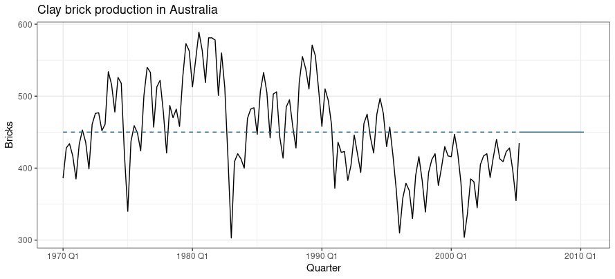

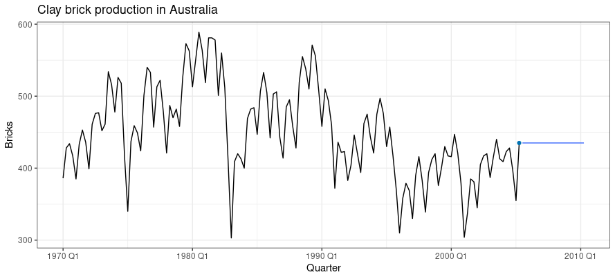

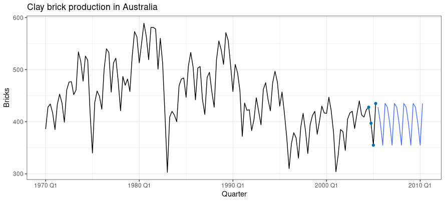

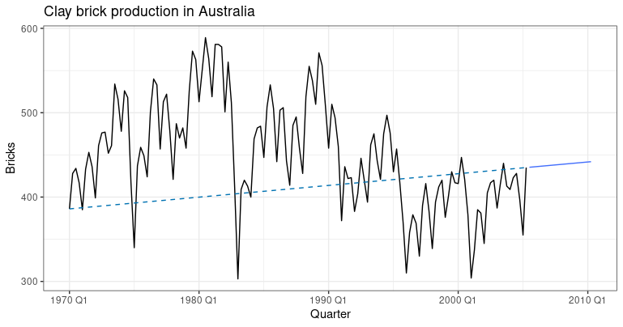

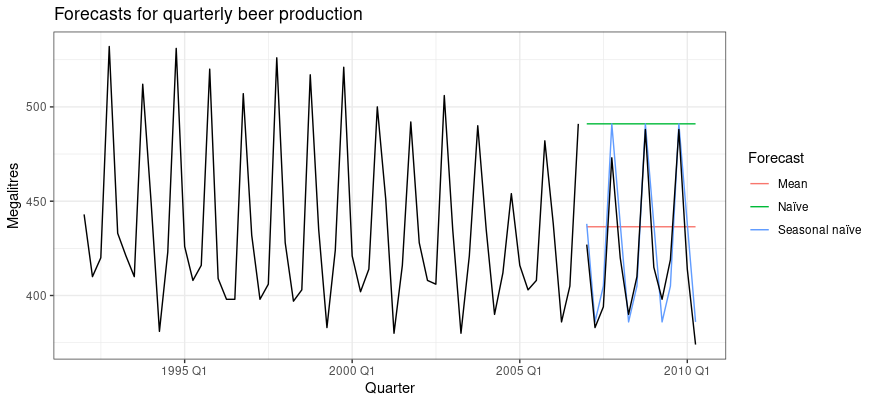

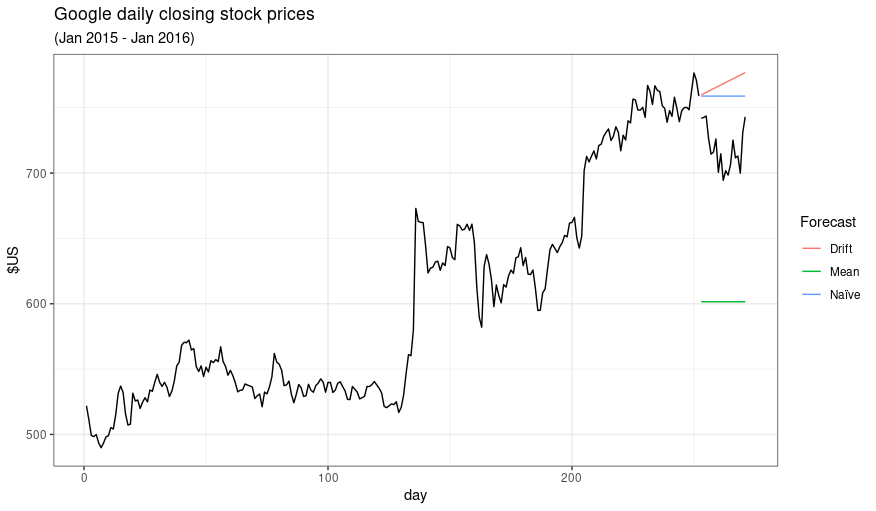

Sometimes one of these simple methods is the best available; in other cases they fail (as with Google stock prices). Either way, they serve as useful **common-sense benchmarks** to corroborate the method of choice. Below, we explore the motivation behind the $M$, $N$ and $D$ methods. (The $S$ method is a direct extension of the $N$ case.)

## Heuristics

Some methods perform better than others, and which works best depends on the nature of the series being forecast.

::::: slidebox
[Our broad goal is signal extraction]{.slide-label}

::: slide-body
It helps to think of the variable we want to forecast as an additive combination of signal and noise. The signal is the predictable component; the noise is what remains: $$ Y_t = \text{Signal}_t + \text{Noise}_t. $$

- The term "noise" evokes the static on a busy street or a weak radio signal. Audible noise and noise in data are statistically no different.
- It is up to us to find a model that captures the signal buried in the noise and extrapolates it appropriately. This is not always easy.
- Complex patterns may look random until we know what to look for; and completely random data may appear to have an interesting pattern.
:::

::: slide-footer
Forecasting = extracting the predictable signal and extrapolating it.
:::
:::::

::::: slidebox
[What was (white) noise again?]{.slide-label}

::: slide-body
- Noise is what remains once all the signal has been extracted from $Y_t$ and there is nothing further to forecast.
- Noise is where the time series analyst quits and says, "Not my headache anymore!"
:::

::: slide-footer
Keep extracting signal until only noise is left — then stop.
:::
:::::

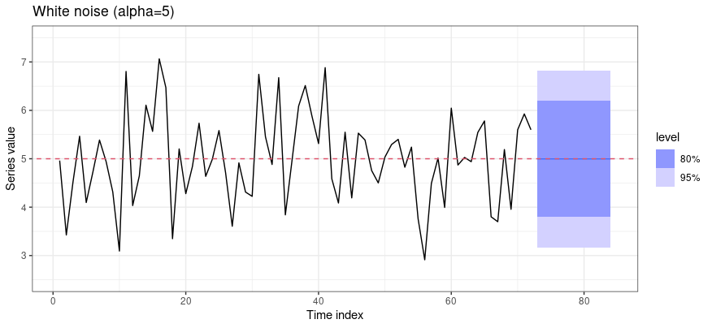

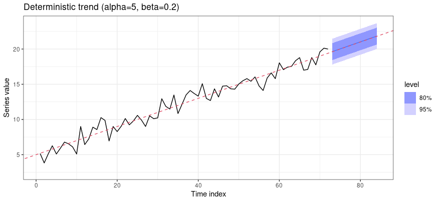

::::: slidebox
[Using common sense (and knowing when to quit)]{.slide-label}

::: slide-body
**Case 1.** The simplest signal-plus-noise model: $Y_t = \alpha + \varepsilon_t$, where $\varepsilon_t \sim \mathsf{WN}(0,\sigma^2)$.

- The most sensible method is the $M$ method: forecast the estimated mean in every future period.
- Once we estimate $\alpha$, there is no further signal (for point forecasts); only un-forecastable noise remains, and the analyst quits.
- The $M$ method here is equivalent to regressing $Y_t$ on an intercept.

**Case 2.** Add a layer of complexity: $Y_t = \alpha + \beta t + \varepsilon_t$, where $\varepsilon_t \sim \mathsf{WN}(0,\sigma^2)$.

- The $M$ method would be a silly choice given the non-stationarity. The sensible thing is to estimate the parameters by linear regression and forecast via $Y_{T+h\mid T} = \alpha + \beta(T+h)$.
- Equivalently, apply the $M$ method to the de-trended series $Y_t - \beta t$ (the Frisch–Waugh–Lovell theorem) — and we are back to Case 1, after which we quit.

The forecast-error variance in these noise cases is constant.
:::

::: slide-footer
Mean for a flat series; regression/de-trend for a deterministic trend.
:::
:::::

::::: slidebox
[What about the case of a stochastic trend?]{.slide-label}

::: slide-body
**Case 3.** It is not the original series but its period-on-period *change* that is noise (with no signal in the change): $\Delta Y_t = \varepsilon_t$, where $\varepsilon_t \sim \mathsf{WN}(0,\sigma^2)$.

- This is the random walk, $Y_t = Y_{t-1} + \varepsilon_t$. The only signal to forecast the *level* of $Y_t$ is in $Y_{t-1}$. Blindly using the sample mean would be misguided.
- The forecast-error variance increases linearly in the horizon (so the forecast-error standard deviation increases as $\sqrt{h}$).

**Case 4.** Extend Case 3 to include a signal in the *change*: $\Delta Y_t = \alpha + \varepsilon_t$, where $\varepsilon_t \sim \mathsf{WN}(0,\sigma^2)$.

- This is the random walk with drift, $Y_t = \alpha + Y_{t-1} + \varepsilon_t$, or $Y_t = \alpha(t-1) + Y_1 + \varepsilon_2 + \cdots + \varepsilon_t$.
- Absent a stochastic trend, we could identify $\alpha$ (at time $T$) as $\alpha = (Y_T - Y_1)/(T-1)$ — exactly the motivation behind the $D$ method.
:::

::: slide-footer
Random walk → Naïve; random walk with drift → Drift.
:::
:::::

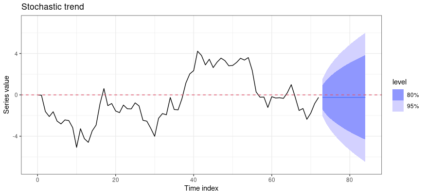

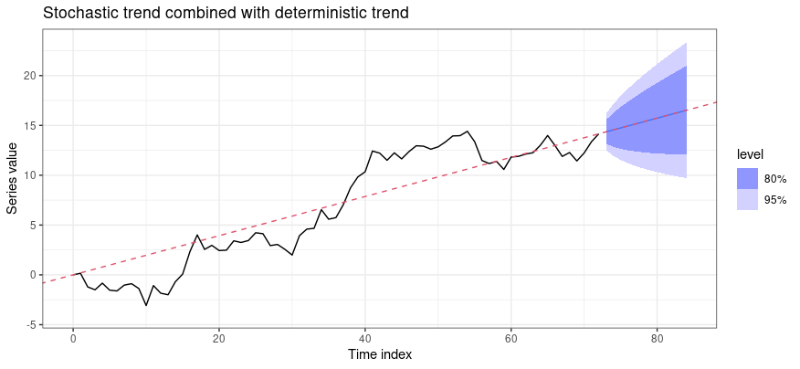

:::: {.callout-note collapse="true"}
## Watch: comparing the common-sense methods

::: {.content-visible when-format="html"}
```{shinylive-r}
#| standalone: true
#| viewerHeight: 540

library(shiny)

ui <- fluidPage(
  tags$style(HTML("body{font-family:system-ui,sans-serif;}")),
  titlePanel("Mean / Naive / Drift forecasts"),
  sidebarLayout(
    sidebarPanel(
      selectInput("type", "Underlying series",
        c("Stable mean", "Linear trend", "Random walk", "Random walk + drift"),
        "Random walk + drift"),
      sliderInput("T", "Training length T", 40, 200, 100, 20),
      sliderInput("h", "Forecast horizon h", 5, 60, 30, 5),
      sliderInput("seed", "Random seed", 1, 100, 11, 1)
    ),
    mainPanel(plotOutput("plot", height = "440px"))
  )
)

server <- function(input, output) {
  output$plot <- renderPlot({
    set.seed(input$seed)
    n <- input$T; e <- rnorm(n)
    y <- switch(input$type,
      "Stable mean"          = 5 + e,
      "Linear trend"         = 0.2 * (1:n) + e,
      "Random walk"          = cumsum(e),
      "Random walk + drift"  = 0.2 * (1:n) + cumsum(e))
    h <- input$h; fut <- (n + 1):(n + h)
    fM <- rep(mean(y), h)                       # Mean
    fN <- rep(y[n], h)                          # Naive
    fD <- y[n] + (1:h) * (y[n] - y[1]) / (n - 1)# Drift
    plot(1:n, y, type = "l", xlim = c(1, n + h), lwd = 2,
         xlab = "t", ylab = expression(Y[t]),
         ylim = range(y, fM, fN, fD))
    lines(fut, fM, col = 2, lwd = 2); lines(fut, fN, col = 3, lwd = 2)
    lines(fut, fD, col = 4, lwd = 2); abline(v = n, lty = 3)
    legend("topleft", c("Mean", "Naive", "Drift"),
           col = c(2, 3, 4), lwd = 2, bty = "n")
  })
}

shinyApp(ui, server)
```
:::
::::

## Diagnostics and performance checks (in practice)

The idea of "knowing when to quit" — persevering with signal extraction until only noise remains — motivates a few diagnostic checks to gauge the quality of our forecasts.

::::: slidebox
[What essential properties are we looking for?]{.slide-label}

::: slide-body
A good fitted model yields residuals with the following **essential** properties:

1. The residuals have **zero mean**. (Otherwise the forecasts are biased.)
2. The residuals are **uncorrelated**. (Otherwise there is information left in the residuals to be exploited.)
:::

::: slide-footer
Zero-mean, uncorrelated residuals — the bare minimum for a usable forecast.
:::
:::::

Any model failing these can be improved upon. (A model that *satisfies* them is not necessarily best — different models can satisfy both properties; checking them gauges whether a method exploits all available information, but is not a good way to choose among competing methods that already satisfy them.) The next two properties are not essential but desirable.

::::: slidebox
[What desirable properties are we looking for?]{.slide-label}

::: slide-body
Some nice-to-have (not essential) properties when fitting a model for forecasting:

1. The residuals exhibit **homoskedasticity**.
2. The residuals look broadly **normally distributed**.

These make the calculation of forecast intervals easier. A method that does not satisfy them is not necessarily improvable (we may have to accept what we have); an alternative for forecast intervals is bootstrapping.
:::

::: slide-footer
Homoskedastic, roughly normal residuals make interval construction easy.
:::
:::::

Consider again Google stock prices. The residuals from the naïve method (the large positive jump is 17 July 2015, when the price rose 16% on strong results) are analysed by FPP:

> *These graphs show that the naïve method produces forecasts that appear to account for all available information. The mean of the residuals is close to zero and there is no significant correlation in the residuals series… apart from the one outlier… the residual variance can be treated as constant… The histogram suggests that the residuals may not be normal — the right tail seems a little too long… Consequently, forecasts from this method will probably be quite good, but prediction intervals that are computed assuming a normal distribution may be inaccurate.*

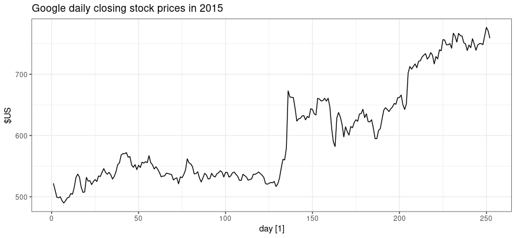

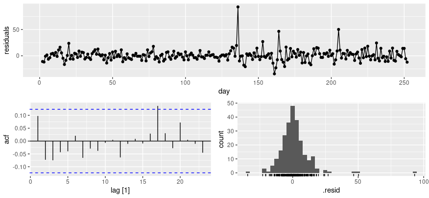

After fitting, it is important to evaluate forecast accuracy using **genuine forecasts**. The size of in-sample residuals is not a reliable indicator of out-of-sample forecast errors. Accuracy can only be determined by how well a model performs on **new data** not used in fitting. It is common to separate the data (at the outset) into **training** and **test** portions: the training data estimate parameters; the test data evaluate accuracy. The test set is typically about 20–25% of the total sample (ideally at least as large as the maximum forecast horizon). Note that a model fitting the training data well need not forecast well; a perfect fit can always be obtained with enough parameters, but over-fitting is just as bad as missing a systematic pattern. One can compute the $h$-s.a. mean-square forecast error (MSFE), $$ \frac{1}{h}\sum_{k=1}^{h}\left(Y_{T+h} - Y_{T+h\mid T}\right)^2, $$ and pick the candidate (from a shortlist fitted on the training set) with the lowest estimated MSFE at the desired horizon.

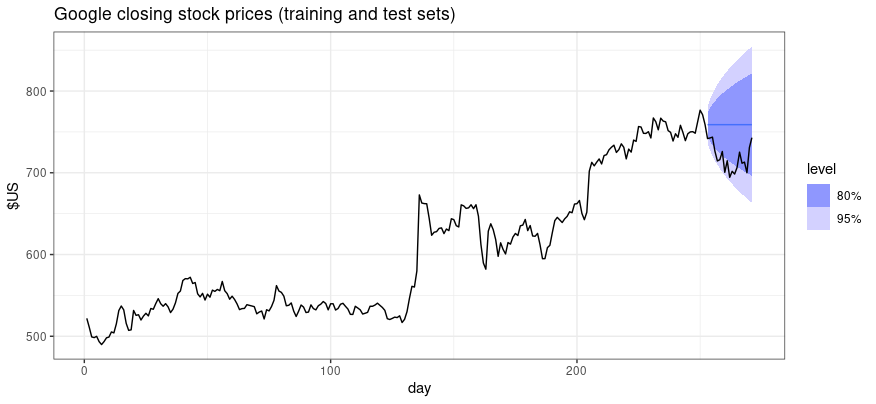

## Forecast-error variance formulas for simple methods

Once diagnostics are done and our point forecasts satisfy the essential and desirable properties, we can compute forecast intervals. Below is a summary of the $h$-s.a. forecast-error variances (FEV), both for known parameters and (non-examinable) for unknown parameters:

| Method | $h$-s.a. FEV (params known) | $h$-s.a. FEV (params unknown) |
|:---:|:---:|:---:|
| $M$ | $\sigma^2$ | $\widehat{\sigma}^2(1 + 1/T)$ |
| $N$ | $\sigma^2 h$ | $\widehat{\sigma}^2 h$ |
| $S$ | $\sigma^2(k+1)$ | $\widehat{\sigma}^2(k+1)$ |
| $D$ | $\sigma^2 h$ | $\widehat{\sigma}^2 h(1 + h/(T-1))$ |

These expressions are handy for back-of-the-envelope calculations: $$ \widehat{Y}_{T+h\mid T} \pm 2\sqrt{\widehat{\mathsf{FEV}}(Y_{T+h\mid T})} $$ gives an approximate 95–96% forecast interval (under normality).

## Optimal prediction (in theory)

Suppose your task is to guess a stranger's salary, $Y$. What would be your best guess? $\mathsf{E}(Y)$ — treat the stranger as an average person. But your mind scans for information, $\mathcal{F}$, that might improve the guess. Would it help if the individual wore a designer suit and drove up in a Bentley? Or wore tattered rags and had slept under a bridge? What is your best guess now — still $\mathsf{E}(Y)$, or $\mathsf{E}(Y\mid\mathcal{F})$?

::::: slidebox
[Why is the conditional mean the optimal (MMSE) predictor? (1 of 2)]{.slide-label}

::: slide-body
Suppose we wish to guess, $g$, the value of a random variable $Y$; our error is $Y - g$. Take as our criterion for the best (uninformed) guess $$ g^{\text{best}} = \arg\min_g \mathsf{E}\left((Y-g)^2\right). $$ Then $$\begin{aligned} \mathsf{E}\left((Y-g)^2\right) &= \mathsf{E}\left(\big((Y-\mathsf{E}(Y)) + (\mathsf{E}(Y)-g)\big)^2\right) \\ &= \mathsf{E}\left((Y-\mathsf{E}(Y))^2\right) + (\mathsf{E}(Y)-g)^2, \end{aligned}$$ a sum of non-negative terms. Since the first term has nothing to do with our guess, the only way to minimise $\mathsf{E}((Y-g)^2)$ is to set $g = \mathsf{E}(Y)$, eliminating the second term. Thus $$ g^{\text{best}} = \mathsf{E}(Y). $$
:::

::: slide-footer
With no information, the best squared-error guess is the unconditional mean.
:::
:::::

::::: slidebox
[Why is the conditional mean the optimal (MMSE) predictor? (2 of 2)]{.slide-label}

::: slide-body
Now suppose a new random variable $X$ can inform our guess, $g_{\textsf{informed}} = g(X)$. The objective becomes $$ \min_{g(X)} \mathsf{E}\left((Y-g(X))^2\right). $$ By the law of iterated expectations, $$ \mathsf{E}\left((Y-g(X))^2\right) = \mathsf{E}\left(\mathsf{E}\left((Y-g(X))^2\mid X\right)\right). $$ Consider the inner expectation when $X = x$ (a constant): $\mathsf{E}((Y-g(x))^2\mid X=x)$, where $g(x)$ is just a constant. Applying the previous result to the conditional distribution of $Y$ given $X = x$, the best guess for each $x$ is $g(x) = \mathsf{E}(Y\mid X=x)$. Since this holds for all functions $g(\cdot)$, $$ g^{\text{best}}_{\textsf{informed}} = \mathsf{E}(Y\mid X) $$ is unambiguously the minimum mean-square-error (MMSE) forecast.
:::

::: slide-footer
With information $X$, the best forecast is the conditional expectation $\mathsf{E}(Y\mid X)$.
:::
:::::

In time series, the information is the past: with $X \equiv \mathcal{F}_t$, the optimal forecast of $Y_{t+h}$ is the conditional expectation $\mathsf{E}(Y_{t+h}\mid\mathcal{F}_t)$.

## Forecasting in the $\mathsf{ARIMA}$ framework

::::: slidebox
[The story so far…]{.slide-label}

::: slide-body
- We framed forecasting as signal extraction and extrapolation.
- We analysed simple methods for a deterministic trend, a stochastic trend, and a combination, plus one method for seasonality.
- We justified the simple methods heuristically. Our motto was not "don't quit until there's stationarity" but rather **"don't quit until you hear the noise."**
- Recall the broad strategy: $Y_t = T_t + S_t + R_t$, where $R_t \sim \mathsf{ARIMA}(p,d,q)$, or $Q_t = \Delta^d R_t \sim \mathsf{ARMA}(p,q)$.
- We have yet to exploit the dependence structure of $Q_t$, which — despite being stationary — is not noise. There is still signal to extract (at least at short horizons).
:::

::: slide-footer
Even after removing trend and seasonality, the stationary remainder still carries forecastable signal.
:::
:::::

### $\mathsf{AR}(1)$

::::: slidebox
[How to create optimal point forecasts in the $\mathsf{AR}(1)$ case?]{.slide-label}

::: slide-body
Consider the $\mathsf{AR}(1)$ process with non-zero mean $\mu$: $$ Y_t - \mu = \phi(Y_{t-1} - \mu) + \varepsilon_t, \quad |\phi| < 1, $$ where $\varepsilon_t \sim \mathsf{WN}(0,\sigma^2)$ is an innovation with $\mathsf{E}(\varepsilon_{t+j}\mid\mathcal{F}_t) = 0$ for $j = 1, 2, \ldots$

Leading one period and taking conditional expectations gives the forecast equation $$ Y_{t+1\mid t} = \mu + \phi(Y_t - \mu) $$ — the process mean plus a fraction $\phi$ of the current deviation from the mean. In general, the $h$-s.a. forecast is obtained **recursively**: $$ Y_{t+h\mid t} = \mu + \phi(Y_{t+h-1\mid t} - \mu), \quad h = 1, 2, 3, \ldots $$ Substituting repeatedly gives the **forecast function** originating at time $t$: $$ Y_{t+h\mid t} = \mu + \phi^h(Y_t - \mu). $$ The current deviation is discounted by $\phi^h$, which decreases with lead time, so $Y_{t+h\mid t} \to \mu$ for large $h$ (since $|\phi| < 1$).
:::

::: slide-footer
$Y_{t+h\mid t} = \mu + \phi^h(Y_t - \mu)$ — the deviation decays geometrically towards the mean.
:::
:::::

::::: slidebox
[How to compute FEV in the $\mathsf{AR}(1)$ case?]{.slide-label}

::: slide-body
Define the 1-s.a. forecast error $\varepsilon_{t+1\mid t} := Y_{t+1} - Y_{t+1\mid t}$. In the $\mathsf{AR}(1)$ case, $\varepsilon_{t+1\mid t} = \varepsilon_{t+1}$ — a noise element independent of $Y_1, \ldots, Y_t$ — so $\mathsf{Var}(\varepsilon_{t+1\mid t}\mid\mathcal{F}_t) = \sigma^2$.

For the $h$-s.a. forecast error, using the $\mathsf{MA}(\infty)$ representation, cancellations give $$ \varepsilon_{t+h\mid t} = \varepsilon_{t+h} + \phi\varepsilon_{t+h-1} + \cdots + \phi^{h-1}\varepsilon_{t+1}, $$ which depends on the $h$ innovations that haven't happened yet. Hence $$\begin{aligned} \mathsf{Var}(\varepsilon_{t+h\mid t}\mid\mathcal{F}_t) &= \sigma^2\left(1 + \phi^2 + \phi^4 + \cdots + \phi^{2(h-1)}\right) \\ &= \sigma^2\left(\frac{1 - \phi^{2h}}{1-\phi^2}\right), \end{aligned}$$ by summing a finite geometric series. Since $|\phi| < 1$, $\mathsf{Var}(\varepsilon_{t+h\mid t}\mid\mathcal{F}_t) \to \sigma^2/(1-\phi^2)$ for large $h$.
:::

::: slide-footer
The FEV rises with $h$ but is bounded above by the process variance $\sigma^2/(1-\phi^2)$.
:::
:::::

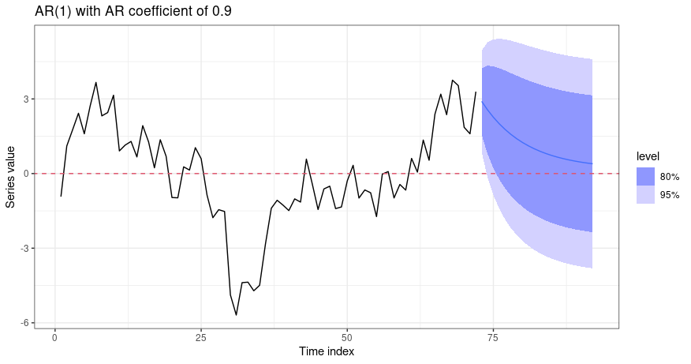

### $\mathsf{MA}(1)$

::::: slidebox
[How to create optimal point forecasts in the $\mathsf{MA}(1)$ case?]{.slide-label}

::: slide-body
Consider the $\mathsf{MA}(1)$ process with non-zero mean $\mu$: $$ Y_t = \mu + \varepsilon_t - \theta\varepsilon_{t-1}, \quad |\theta| < 1, $$ where $\varepsilon_t \sim \mathsf{WN}(0,\sigma^2)$ with $\mathsf{E}(\varepsilon_{t+j}\mid\mathcal{F}_t) = 0$ for $j = 1, 2, \ldots$

Since $|\theta| < 1$, we can invert the $\mathsf{MA}$ polynomial $\Theta(z) := 1 - \theta z$: $$ (Y_t - \mu) + \theta(Y_{t-1} - \mu) + \theta^2(Y_{t-2} - \mu) + \cdots = \varepsilon_t, $$ the $\mathsf{AR}(\infty)$ representation. For large $t$, $\mathsf{E}(\varepsilon_t\mid\mathcal{F}_t) \approx \varepsilon_t$. Leading one period, $\mathsf{E}(Y_{t+1}\mid\mathcal{F}_t) = \mu - \theta\,\mathsf{E}(\varepsilon_t\mid\mathcal{F}_t) \approx \mu - \theta\varepsilon_t$, so $Y_{t+1\mid t} = \mu - \theta\varepsilon_t$. For $h > 1$, $\mathsf{E}(Y_{t+h}\mid\mathcal{F}_t) = \mu$. Hence $$ Y_{t+h\mid t} = \begin{cases} \mu - \theta\varepsilon_t, & h = 1, \\ \mu, & h = 2, 3, \ldots \end{cases} $$
:::

::: slide-footer
The $\mathsf{MA}(1)$ coefficient informs only the 1-step-ahead forecast; beyond that, the forecast is the mean.
:::
:::::

::::: slidebox
[How to compute FEV in the $\mathsf{MA}(1)$ case?]{.slide-label}

::: slide-body
With $\varepsilon_{t+1\mid t} := Y_{t+1} - Y_{t+1\mid t}$, we have $\varepsilon_{t+1\mid t} = \varepsilon_{t+1}$, and for $h > 1$, $\varepsilon_{t+h\mid t} = \varepsilon_{t+h} - \theta\varepsilon_{t+h-1}$. It follows that $$ \mathsf{Var}(\varepsilon_{t+h\mid t}\mid\mathcal{F}_t) = \begin{cases} \sigma^2, & h = 1, \\ \sigma^2(1 + \theta^2), & h = 2, 3, \ldots \end{cases} $$
:::

::: slide-footer
The FEV jumps once (from $\sigma^2$ to $\sigma^2(1+\theta^2)$) and then stays flat.
:::
:::::

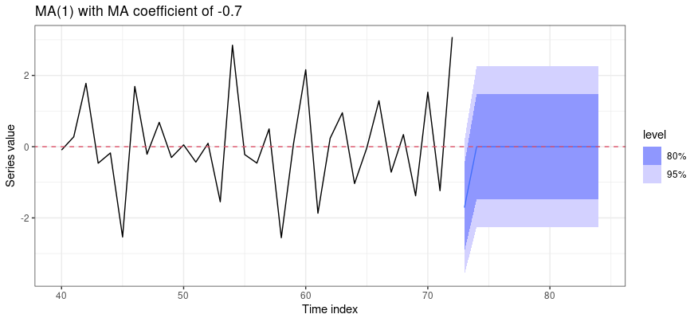

### $\mathsf{ARMA}(1,1)$

::::: slidebox
[How to create optimal point forecasts in the $\mathsf{ARMA}(1,1)$ case?]{.slide-label}

::: slide-body
Consider the $\mathsf{ARMA}(1,1)$ process with non-zero mean $\mu$: $$ Y_t = \mu(1-\phi) + \phi Y_{t-1} + \varepsilon_t - \theta\varepsilon_{t-1}, \quad |\phi|, |\theta| < 1. $$ Leading $h$ periods, (i) setting future innovations to zero and (ii) replacing unknown $Y_t$ with forecasts, gives the recursive equations $$\begin{aligned} Y_{t+1\mid t} &= \mu(1-\phi) + \phi Y_t - \theta\varepsilon_t, \\ Y_{t+2\mid t} &= \mu(1-\phi) + \phi Y_{t+1\mid t}, \\ &\ \vdots \\ Y_{t+h\mid t} &= \mu(1-\phi) + \phi Y_{t+h-1\mid t}. \end{aligned}$$ The $\mathsf{MA}$ coefficient is informative only for the 1-s.a. forecast; for $h > 1$ the autoregressive component takes over. The forecast function at origin $t$ is $$ Y_{t+h\mid t} = \mu + \phi^h(Y_t - \mu) - \phi^{h-1}\theta\varepsilon_t, \quad h \geq 1, $$ and $Y_{t+h\mid t} \to \mu$ for large $h$ (since $|\phi|, |\theta| < 1$).
:::

::: slide-footer
$\mathsf{MA}$ matters for one step; thereafter the $\mathsf{AR}$ root drives decay to the mean.
:::
:::::

::::: slidebox
[How to compute FEV in the $\mathsf{ARMA}(1,1)$ case?]{.slide-label}

::: slide-body
Assume (WLOG) a zero mean, so $(1-\phi L)Y_t = (1-\theta L)\varepsilon_t$. Computing the transfer function (for $z \in \mathbb{C}$), $$\begin{aligned} \Psi(z) := (1-\phi z)^{-1}(1-\theta z) &= (1 + \phi z + \phi^2 z^2 + \cdots)(1 - \theta z) \\ &= 1 + \psi_1 z + \psi_2 z^2 + \cdots, \end{aligned}$$ where $\psi_j := \phi^{j-1}(\phi - \theta)$ for $j = 1, 2, \ldots$ Hence $$\begin{aligned} \mathsf{Var}(\varepsilon_{t+h\mid t}\mid\mathcal{F}_t) &= \sigma^2\left(1 + \psi_1^2 + \cdots + \psi_{h-1}^2\right) \\ &= \sigma^2\left(1 + (\phi-\theta)^2\,\frac{1 - \phi^{2h-2}}{1-\phi^2}\right). \end{aligned}$$
:::

::: slide-footer
The FEV again rises to a finite limit — the process is stationary.
:::
:::::

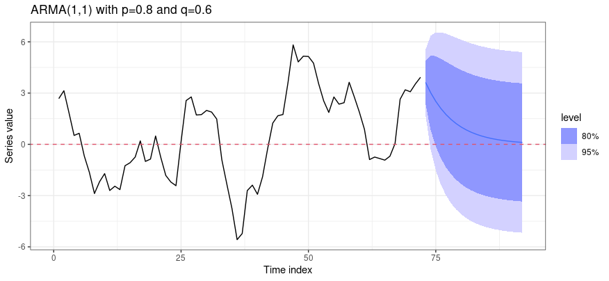

:::: {.callout-note collapse="true"}
## Watch: forecast behaviour across $\mathsf{AR}(1)$, $\mathsf{MA}(1)$, $\mathsf{ARMA}(1,1)$

::: {.content-visible when-format="html"}
```{shinylive-r}
#| standalone: true
#| viewerHeight: 560

library(shiny)

ui <- fluidPage(
  tags$style(HTML("body{font-family:system-ui,sans-serif;}")),
  titlePanel("Forecast function and FEV bands"),
  sidebarLayout(
    sidebarPanel(
      selectInput("model", "Model", c("AR(1)", "MA(1)", "ARMA(1,1)"), "AR(1)"),
      sliderInput("phi", "phi", -0.95, 0.95, 0.7, 0.05),
      sliderInput("th",  "theta", -0.95, 0.95, 0.5, 0.05),
      sliderInput("h",   "Forecast horizon h", 5, 40, 20, 5),
      sliderInput("seed","Random seed", 1, 100, 3, 1)
    ),
    mainPanel(plotOutput("plot", height = "460px"))
  )
)

server <- function(input, output) {
  output$plot <- renderPlot({
    set.seed(input$seed)
    n <- 80; e <- rnorm(n); y <- numeric(n)
    phi <- input$phi; th <- input$th
    for (t in 2:n) {
      ar <- if (input$model %in% c("AR(1)", "ARMA(1,1)")) phi * y[t - 1] else 0
      ma <- if (input$model %in% c("MA(1)", "ARMA(1,1)")) -th * e[t - 1] else 0
      y[t] <- ar + e[t] + ma
    }
    h <- input$h; f <- numeric(h); v <- numeric(h)
    if (input$model == "AR(1)") {
      for (k in 1:h) { f[k] <- phi^k * y[n]; v[k] <- (1 - phi^(2 * k)) / (1 - phi^2) }
    } else if (input$model == "MA(1)") {
      f[1] <- -th * e[n]; if (h > 1) f[2:h] <- 0
      v[1] <- 1; if (h > 1) v[2:h] <- 1 + th^2
    } else {
      f[1] <- phi * y[n] - th * e[n]
      if (h > 1) for (k in 2:h) f[k] <- phi * f[k - 1]
      psi <- phi^((1:h) - 1) * (phi - th)
      for (k in 1:h) v[k] <- 1 + if (k > 1) sum(psi[1:(k - 1)]^2) else 0
    }
    fut <- (n + 1):(n + h); sd <- sqrt(v)
    plot(1:n, y, type = "l", xlim = c(40, n + h), lwd = 2,
         xlab = "t", ylab = expression(Y[t]),
         ylim = range(y[40:n], f + 2 * sd, f - 2 * sd))
    polygon(c(fut, rev(fut)), c(f + 2 * sd, rev(f - 2 * sd)),
            col = rgb(0, 0, 1, 0.15), border = NA)
    lines(fut, f, col = 4, lwd = 2); abline(v = n, lty = 3, h = 0)
    legend("topleft", paste(input$model, "forecast +/- 2 sd"), bty = "n")
  })
}

shinyApp(ui, server)
```
:::
::::

### $\mathsf{ARIMA}(1,1,1)$

::::: slidebox
[How to create optimal point forecasts in the $\mathsf{ARIMA}(1,1,1)$ case?]{.slide-label}

::: slide-body
Consider the $\mathsf{ARIMA}(1,1,1)$ process (for some constant $\alpha$): $$ Y_t - Y_{t-1} = \alpha + \phi(Y_{t-1} - Y_{t-2}) + \varepsilon_t - \theta\varepsilon_{t-1}, \quad |\phi|, |\theta| < 1. $$ Leading one period and setting future innovations to zero, $$ Y_{t+1\mid t} = \alpha + (1+\phi)Y_t - \phi Y_{t-1} - \theta\varepsilon_t, $$ and recursively $$\begin{aligned} Y_{t+2\mid t} &= \alpha + (1+\phi)Y_{t+1\mid t} - \phi Y_t, \\ &\ \vdots \\ Y_{t+h\mid t} &= \alpha + (1+\phi)Y_{t+h-1\mid t} - \phi Y_{t+h-2\mid t}. \end{aligned}$$
:::

::: slide-footer
An $\mathsf{ARIMA}(1,d,1)$ with $d = 1 \neq 0$ — a stochastic trend in the forecast.
:::
:::::

::::: slidebox
[How to compute FEV in the $\mathsf{I}(1)$ case?]{.slide-label}

::: slide-body
To keep the algebra manageable, set $\phi = \theta = 0$ (the random walk with drift): $Y_t = \alpha + Y_{t-1} + \varepsilon_t$. Leading $h$ periods, $$ Y_{t+h} = \alpha \cdot h + Y_t + \underbrace{\varepsilon_{t+1} + \cdots + \varepsilon_{t+h}}_{\text{all coefficients are } 1}. $$ It follows that $$ \mathsf{Var}(\varepsilon_{t+h\mid t}\mid\mathcal{F}_t) = \sigma^2 \cdot \underbrace{\left(\sum_{k=1}^{h}\psi_k^2\right)}_{\text{non-convergent}}, $$ where $\psi_k = 1$ for every $k \geq 1$. In fact, for any $\mathsf{I}(d)$ series with $d > 0$, the $\psi_k$ weights (functions of $\theta$ and $\phi$) do not decay with $k$. The forecast-error variance therefore **increases without bound** as the lead time grows — with integrated series, forecasting far into the future carries ever-increasing uncertainty.
:::

::: slide-footer
$\mathsf{I}(d)$ with $d>0$: undecaying weights mean unbounded forecast uncertainty.
:::
:::::

## Concluding remarks

::::: slidebox
[Summarising what we have learned…]{.slide-label}

::: slide-body
**Optimal forecasts.** For any stationary $\mathsf{ARMA}$ model, $Y_{t+h\mid t} - \mu$ decays to zero as $h$ increases, and the long-term forecast is simply the mean $\mu$. This agrees with common sense: for stationary $\mathsf{ARMA}$ models the dependence dies out as the time span grows, and this dependence is the only reason we can improve upon the simple $\mu$-based forecast.

**Forecast-error variances.**

- With stationary $\mathsf{ARMA}$ models (other than pure noise), the FEV increases with lead time but is bounded above by the overall process variance.
- With deterministic-trend (plus noise) models, the FEV is constant (equal to the noise variance).
- With stochastic-trend models, the FEV increases without bound.

**Caveats.** In practice, coefficients must be estimated, so the $h$-s.a. forecast contains estimation error and our FEVs are understated (though this vanishes as $T \to \infty$). Forecast errors can exhibit large autocorrelations, so we should update forecasts as new data arrive. Forecast errors from competing models may also be highly correlated.
:::

::: slide-footer
Stationary: forecasts → $\mu$, FEV bounded. Integrated: FEV unbounded.
:::
:::::

------------------------------------------------------------------------

## Review questions

1.  Distinguish between fitted values, backcasts and forecasts. Why might the model that fits the sample best not be the best forecaster?
2.  Define the Mean, Naïve, Seasonal naïve and Drift methods. For each, describe a signal-plus-noise data-generating process for which it is the sensible choice.
3.  State and prove that the conditional expectation $\mathsf{E}(Y\mid X)$ is the minimum mean-square-error predictor of $Y$. Why is this result of central interest in time series forecasting?
4.  Derive the $h$-step-ahead forecast function and forecast-error variance for an $\mathsf{AR}(1)$ process. Contrast the behaviour of the forecast-error variance for stationary $\mathsf{ARMA}$ versus integrated $\mathsf{I}(d)$ ($d>0$) processes.

------------------------------------------------------------------------

## Further reading

- **Hyndman & Athanasopoulos, *Forecasting: Principles and Practice* (FPP), 3rd edn., 2021** — for the introductory material and R examples.
- **SS** — for the underlying theory of forecasting in the $\mathsf{ARMA}$/$\mathsf{ARIMA}$ framework.

------------------------------------------------------------------------
